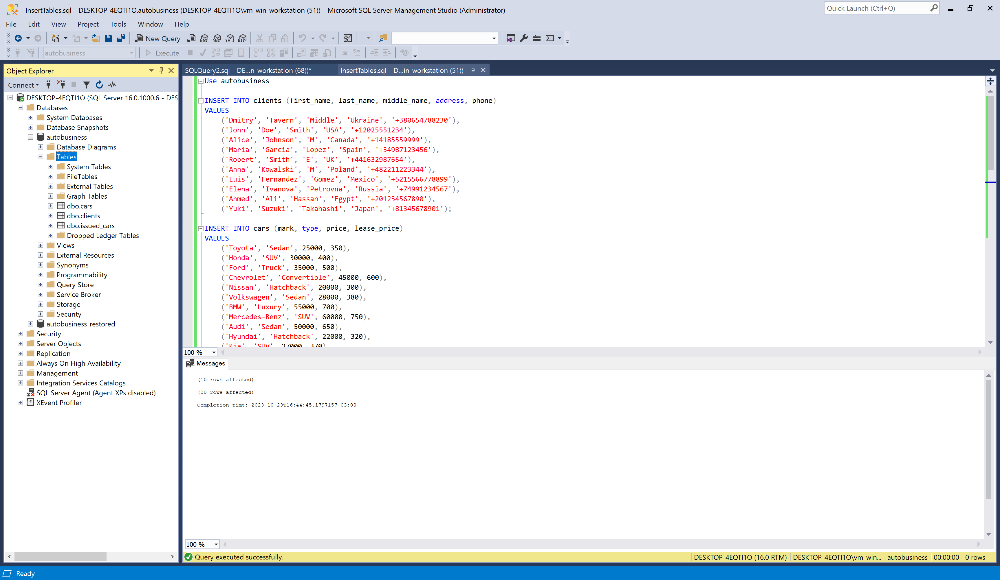
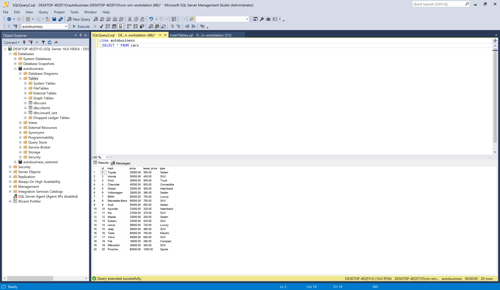
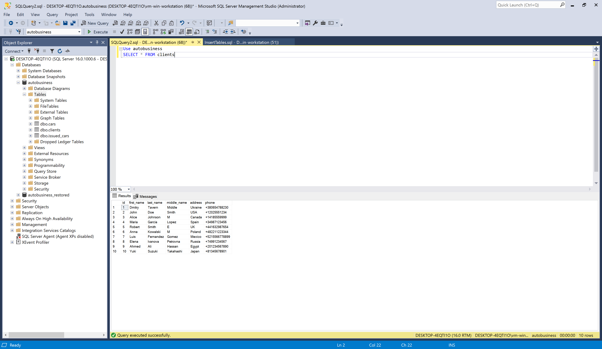
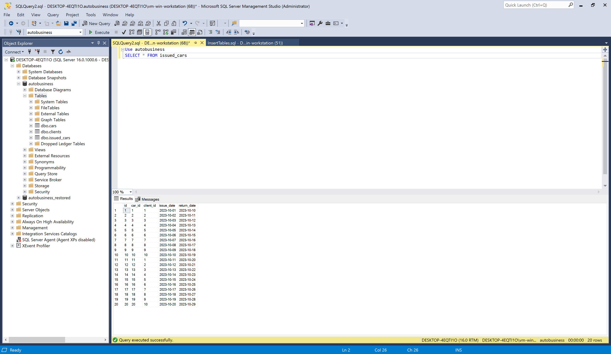
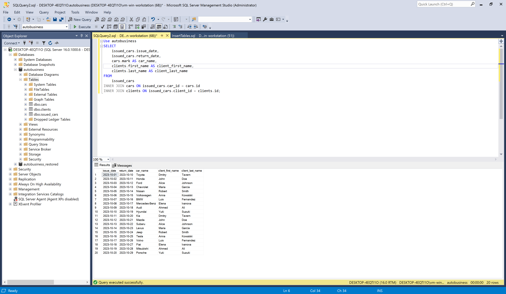
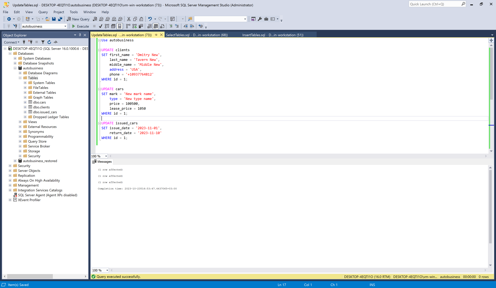
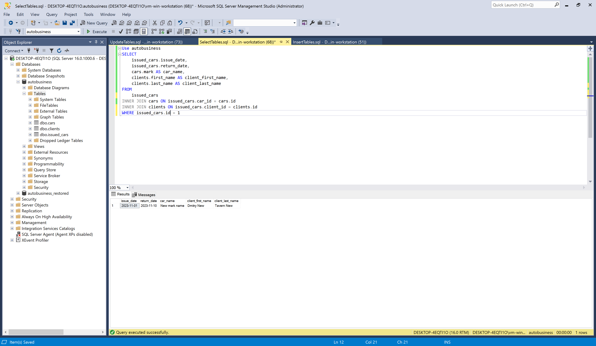
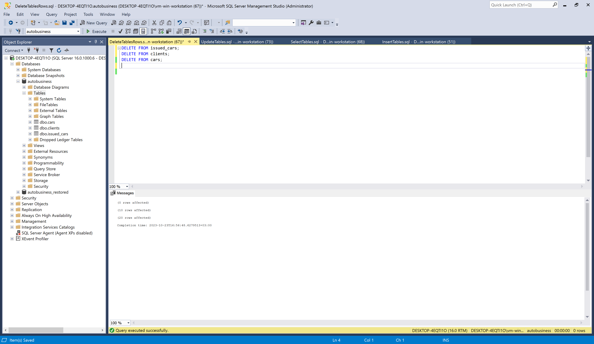

# Lab 6

Subject area: Car rental

- Cars (Car code, Brand, Cost, Rental price, Type)
- Customers (Customer code, Last name, First name, Address, Phone number)
- Issued cars (Document code, Car code, Customer code, Issue date, Return date)

Task:

1. In the SQLServerManagementStudio utility, create a program that will use the INSERT statement to fill all tables with records (10-15 records each).

2. In the SQLServerManagementStudio utility, create a program that will use the UPDATE statement to make replacements in all tables.

3. In the SQLServerManagementStudio utility, create a program that will use the DELETE statement to delete table records.

## Screenshots

