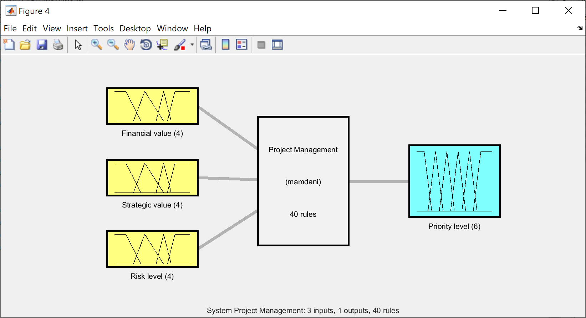
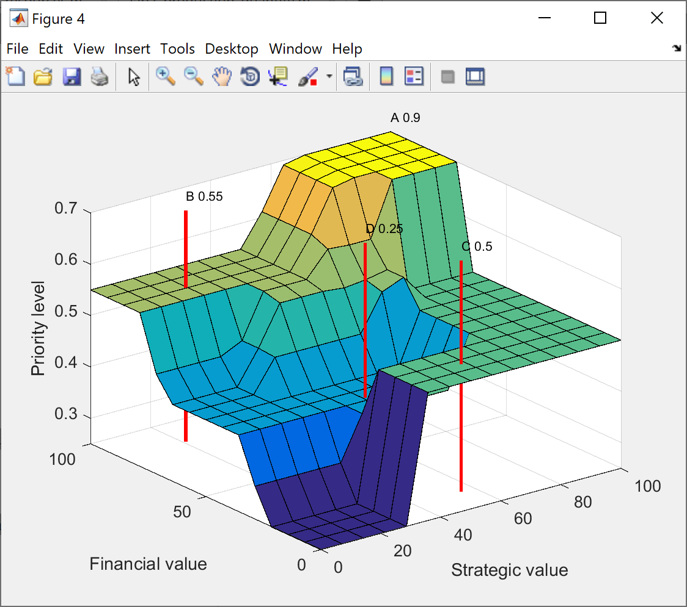

# Homework 1

Task: using MatLab and the fuzzy logic add-on, build a fuzzy logic system that will calculate the project priority based on input variables such as Financial Value, Strategic Value, and Risk Level.

## Screenshots

