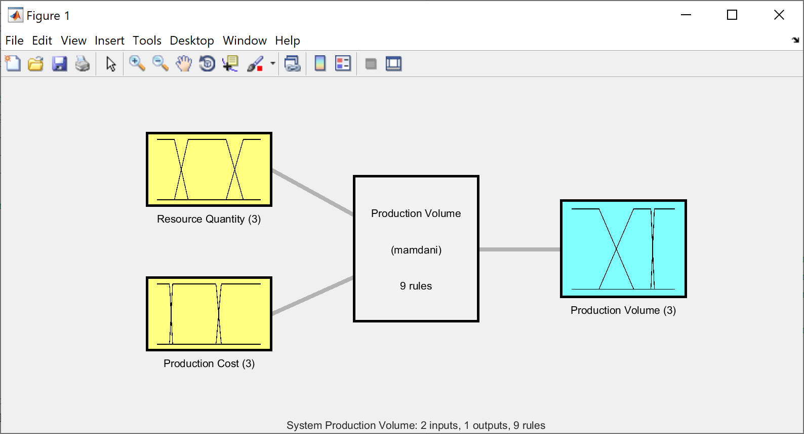
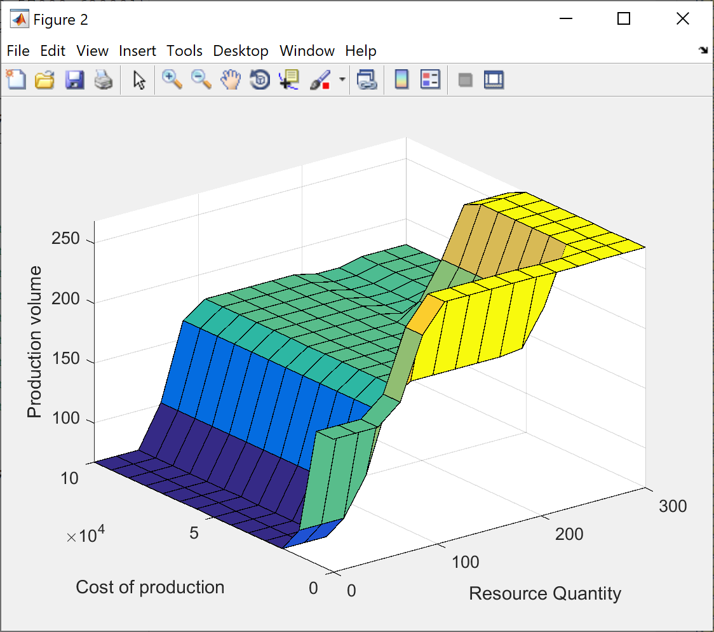
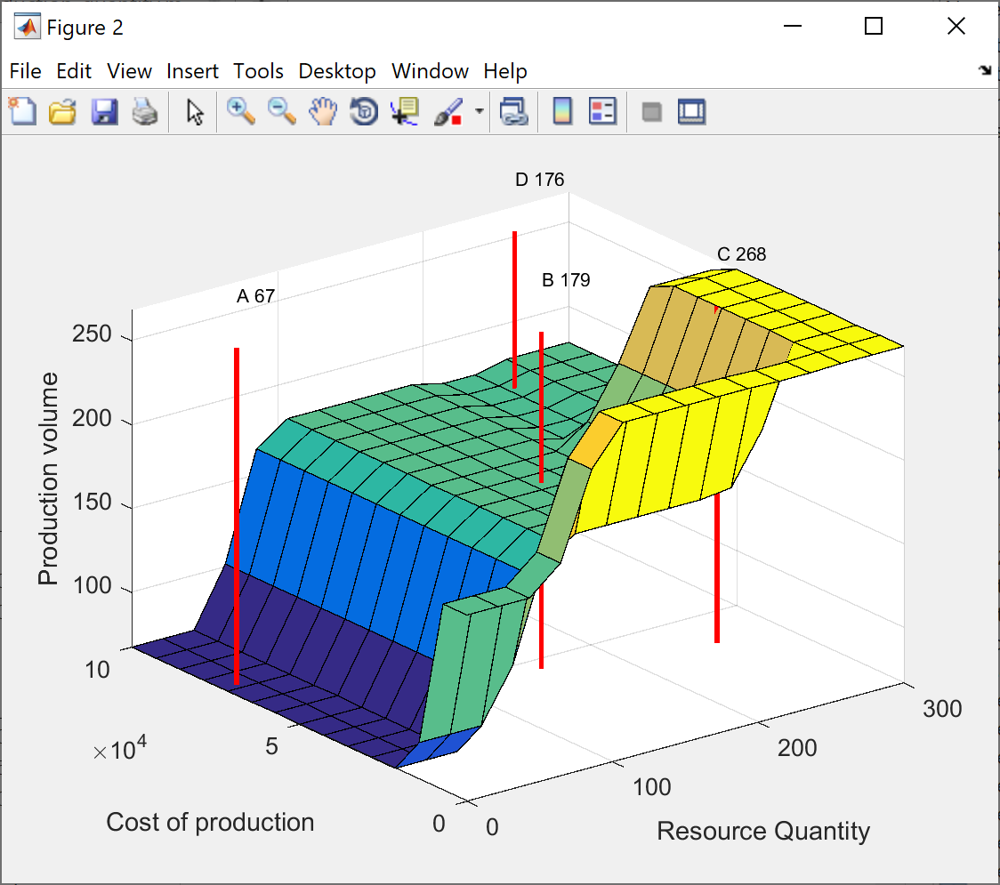

# Lab 2

Task: Build a fuzzy knowledge base (use at least 3 linguistic variables) for the task of planning the volume of production (taking into account possible profit, necessary resources, solvency of the population, sales market, etc.), check it for completeness and perform a fuzzy conclusion for specific values (choose randomly).

## Solution

Fuzzy optimization of production volume

Let's say I work for a company that manufactures and sells products on the market. Every day I receive information about what products have been sold, how much I have earned, and how many resources I have used for production. My task is to determine what volume of products should be produced the next day in order to maximize the company's revenue.

To solve this task, I can use fuzzy logic and build a fuzzy knowledge base that will take into account various factors such as the amount of resources and the cost of production.

### Solution plan

Determine the variables: the amount of resources, the cost of production and the volume of production.

Define linguistic variables and accessory functions:

- B = Number of resources, T=("Low", "Medium", "High"), X=[0, 300], G=("very high", "low or medium"), M - decrease by one degree membership of the fuzzy variable "many", the operation of combining fuzzy sets.

- B = Cost of production, T=("Cheap", "Average", "Expensive"), X=[0, 100000] (tons), G=("very expensive", "average or cheap"), M - increase per unit of the degree of membership of the fuzzy variable "expensive", the operation of combining fuzzy sets.

- B = Volume of production, T=("Low", "Medium", "High"), X=[0, 300], G=("very high", "medium or low"), M - increase by one degree membership of the fuzzy variable "high", the operation of combining fuzzy sets.

### Fuzzy rules

Determine the inference rules that will be used to determine the volume of production:

- If the amount of resources is "Little" and the cost of production is "Expensive", then the volume of production should be "Small"
- If the amount of resources is "Low" AND the cost of production is "Average", then the volume of production should be "Small"
- If the amount of resources is "Little" AND the cost of production is "Cheap", then the volume of production should be "Average"
- If the amount of resources is "Average" AND the cost of production is "Expensive", then the volume of production should be "Average"
- If the amount of resources is "Average" AND the cost of production is "Average", then the volume of production should be "Average"
- If the amount of resources is "Average" AND the production cost is "Cheap", then the production volume should be "High"
- If the amount of resources is "Many" and the cost of production is "Expensive", then the volume of production should be "Average"
- If the amount of resources is "A lot" AND the cost of production is "Average", then the production volume should be "High"
- If the amount of resources is "Abundant" AND the cost of production is "Cheap", then the volume of production should be "High"

### Linguistic variables

Taking into account the selected linguistic variables, the fuzzy rules are as follows:

- If Quantity of resources = "little" AND Cost of production = "expensive", THEN Volume of production = "small"
- If Quantity of resources = "little" AND Cost of production = "average", THEN Volume of production = "small"
- If Quantity of resources = "little" AND Cost of production = "cheap", THEN Volume of production = "average"
- If Quantity of Resources = "Average" AND Cost of Production = "Expensive", THEN Volume of Production = "Average"
- IF Quantity of Resources = "Average" AND Cost of Production = "Average", THEN Volume of Production = "Average"
- If Quantity of Resources = "Average" AND Cost of Production = "Cheap", THEN Volume of Production = "High"
- If Quantity of resources = "a lot" AND Cost of production = "expensive", THEN Volume of production = "average"
- If Quantity of resources = "a lot" AND Cost of production = "Average", THEN Volume of production = "High"
- If Quantity of resources = "a lot" AND Cost of production = "cheap", THEN Volume of production = "high"

### Base for completeness

Let's check the received base for completeness:

- there is at least one rule for each linguistic term of the output variable - the output variable "Volume of production" has 3 terms: "small" is used in rules 1 and 2, "medium" is used in 3, 4, 5 and 7, "high" is used in 6, 8 and 9;

- for any term of an input variable there is at least one rule in which this term is used as prerequisites - there are two input variables "Quantity of resources" and "Cost of production" each of them has 3 terms: "few" is used in 1, 2 and 3 rules, "average" - 4, 5 and 6, "a lot" - in 7, 8 and 9, "expensive" - in 1, 4 and 7, "average" - 2, 5 and 8, "cheap" - 3 , 6 and 9.

So, the obtained base of fuzzy rules is complete.

## Results

As an example, let's take several sets of input values to test our fuzzy system in more detail. The main task of the system is to determine the optimal volume of production.
For example, if the following data was received at the entrance to the system:

- A: Number of resources = 10, Cost of production = 73,000 UAH
- B: Number of resources = 157, Cost of production = 46,000 UAH
- C: Number of resources = 257, Cost of production = 37,000 UAH
- D: Number of resources = 240, Cost of production = 90,000 UAH

