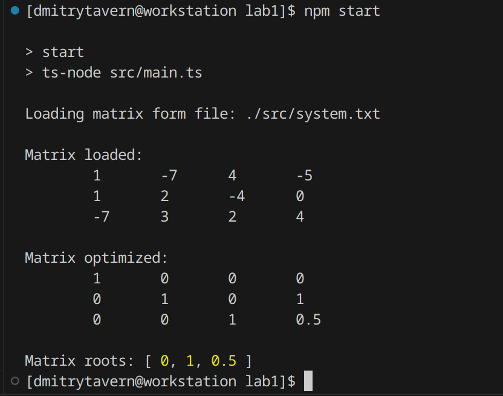

# Lab 1

Task: Solve the system of linear equations using the Jordan-Haus method. Compare the obtained approximate solutions and their errors.


## Screenshots



## How to run

Run in terminal:

```
npm ci
npm run start
```
