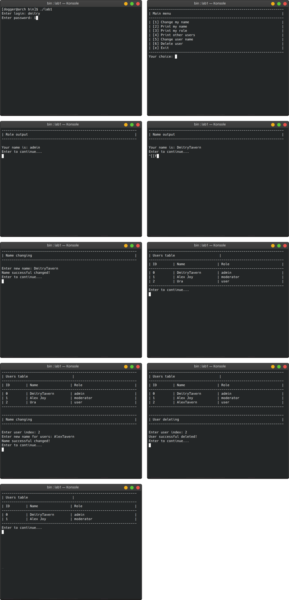

# User managment

Task: need to write a C ++ program with the principles of OOP, where it will be:

- Authorization.
- Separation of users into regular, moderators and admins.
- Add the ability for normal users to view their information and change their name.
- Add the ability for moderators to change the name of other users.
- Add the ability for admins to delete other users.

## Structure

### bin/

This directory needs to store artifacts such as compiled code. By default, ignored by git, creating automatically, after CMake build.

### build/

This directory needs to store CMake preset builds. By default, ignored by git, creating automatically, after CMake build.

### include/

This directory needs to store the header files of the project.

### src/

This directory needs to store the project code.

- factories - directory with all factory classes.
- stores - directory with all store classes.
- users - directory with all users classes.
- authorization.cpp - class for user auth.
- ui.cpp - class for ui.
- main.cpp - main file.

## Screenshots

