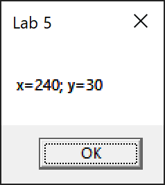
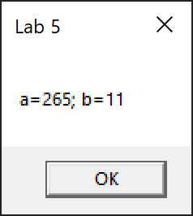

# Lab 5

Task 1: write a simple assembly language program that exchanges the values of variables **x** and **y** using the stack (push and pop commands) and displays these values in an organized window.

Task 2: Write a simple assembly language program that exchanges the values of variables **a** and **b** using a data exchange command of type **xchg** and displays these values in an organized window.

## Screenshots

