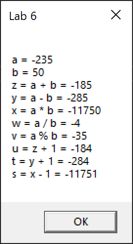

# Lab 6

Task: write a program in MASM where the following equations will be implemented:

```
z = a + b
y = a - b
x = a * b
w = a / b
v = a % b
u = z + 1
t = y + 1
s = x + 1
```

Where:

```
a = -235
b = 50
```

## Screenshots


