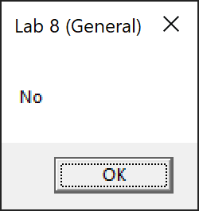
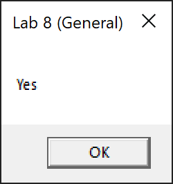
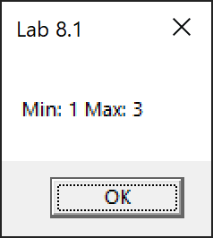
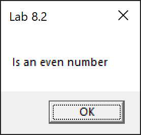
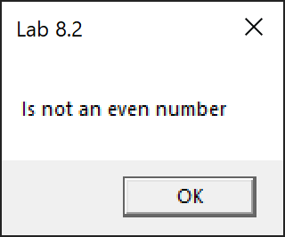

# Lab 8

General task: write a program that checks three numbers for equality (the program was given from the board).

Task 1: write a program that finds the maximum and minimum among the three numbers and outputs them.

Task 2: write a program of your choice. Selected: a program to check the number for parity.

## Screenshots

### General task

```
a = 123; b = 23; c = 123
```



---

```
a = 123; b = 123; c = 123
```



### Task 1

```
a = 1; b = 2; c = 3
a = 3; b = 2; c = 1
a = 2; b = 3; c = 1
```



### Task 2

```
a = 120
```



---

```
a = 121
```


