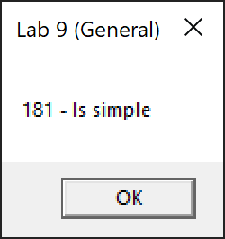
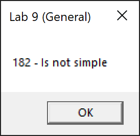
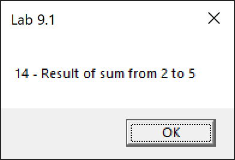
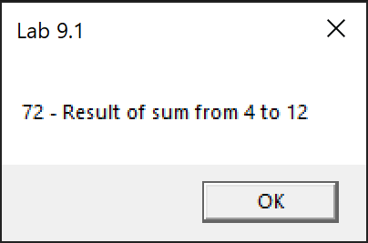

# Lab 9

General task: create a MASM assembly language application that prints the answer to whether a number is prime using loops.

Task 1: create a MASM assembly language application that finds and displays the sum of all numbers from a to b inclusive.

## Screenshots

### General task

```
n = 181
```



```
a = 182
```



### Task 1




