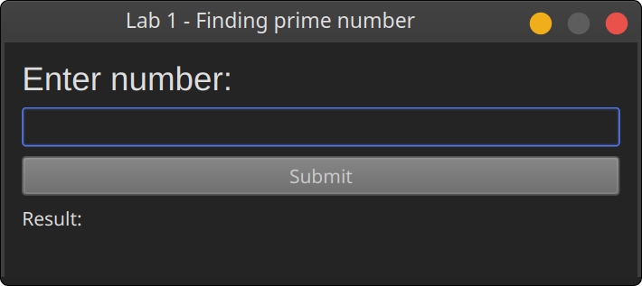

# Finding prime number

Task: need to write a C++/Qt6 application that allows you to enter a natural number, checks if it is prime and displays the result as text.

Language: C++

Framework: Qt6

## Screenshots

