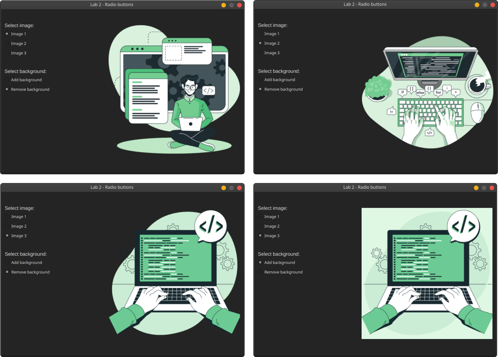

# Radio buttons

Task: need to write a C++/Qt6 program that has one group of radio buttons for selecting an image, and a second group of buttons for adding/removing the background color of the image.

Language: C++

Framework: Qt6

## Screenshots

