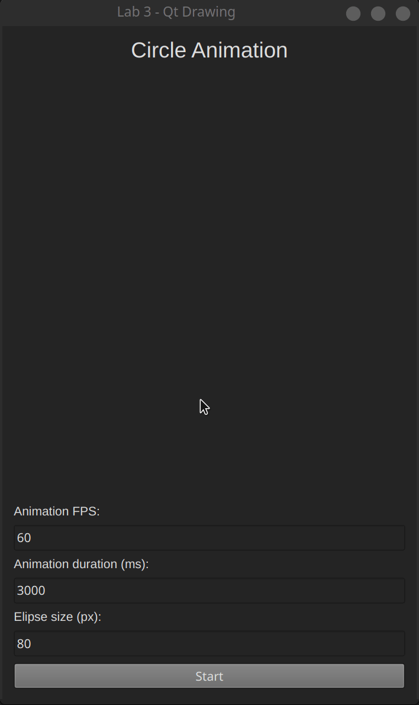

# Qt Drawing

Task: сreate a C++/Qt6 program using QPainter and animate it with QTimer.

Language: C++

Framework: Qt6

## Demonstration

Note: the gif can not properly convey the animation at 24, 60, 120 fps.

