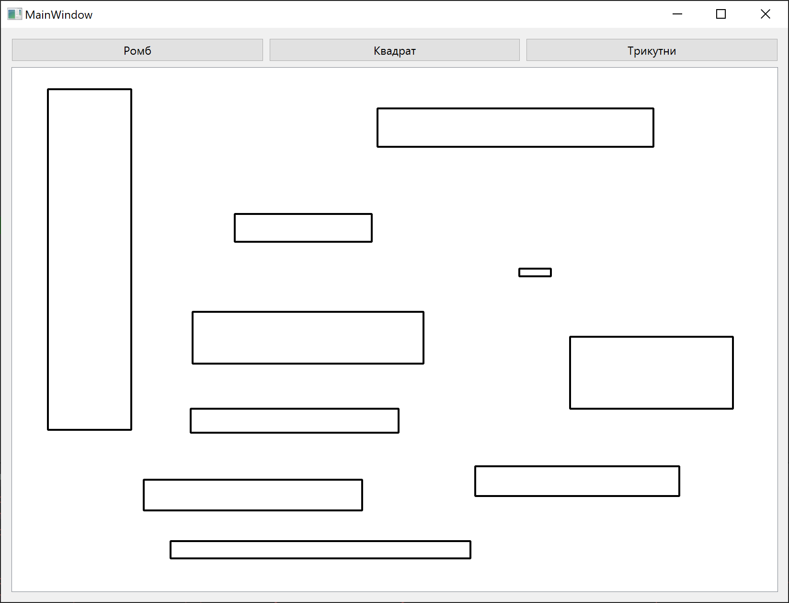
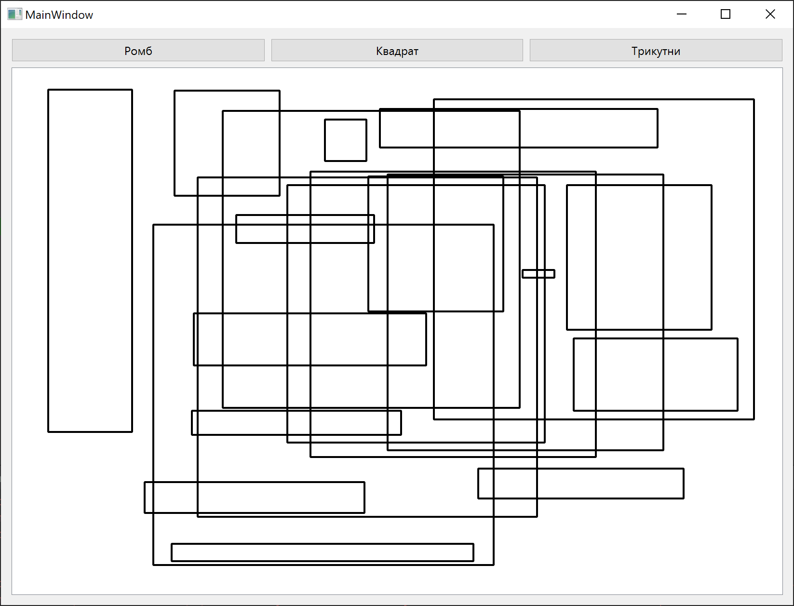
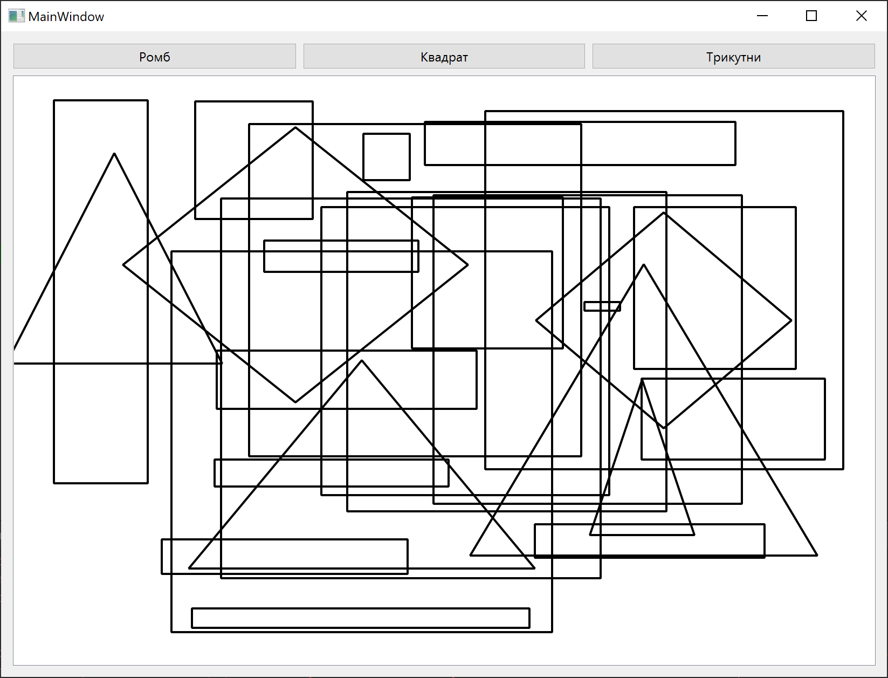

# PaintFigure

Task:

- download the application code.
- launch, check that the project is working.
- make changes:
  - add a check so that a rectangle is drawn by default (without selecting a tool), and when you click on the "Square" button, a square is drawn (a rectangle with the same sides)

## Screenshots

