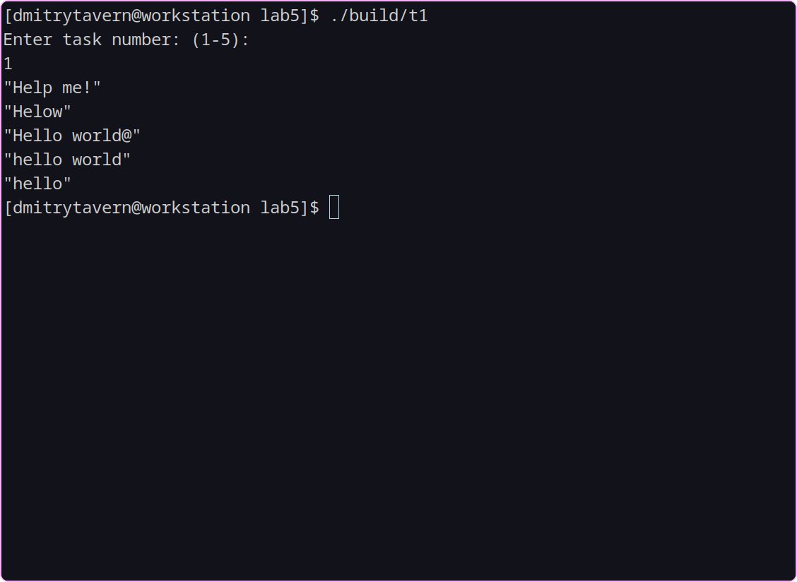
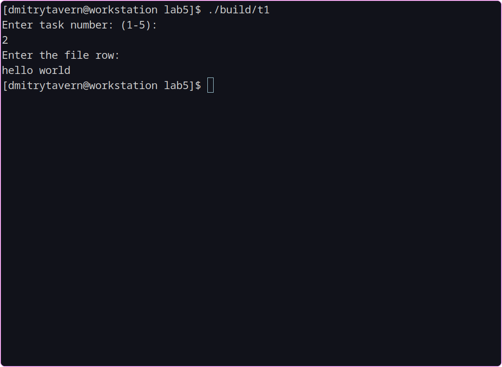
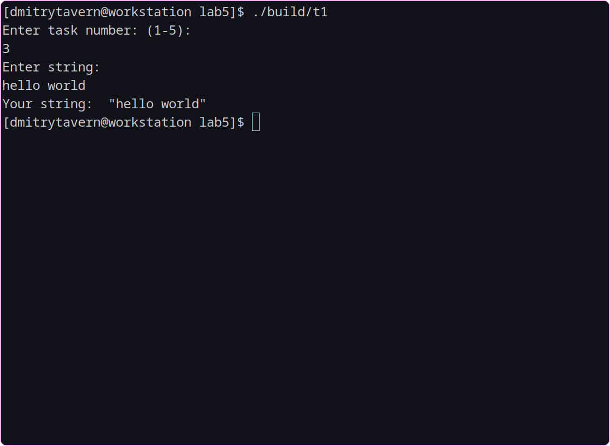
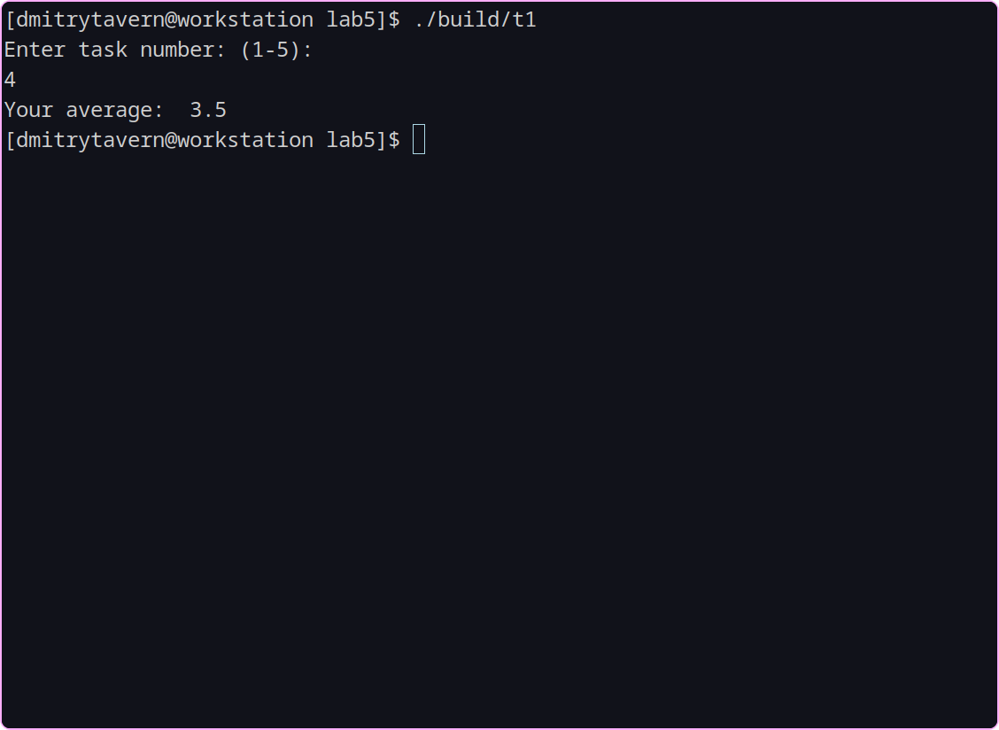
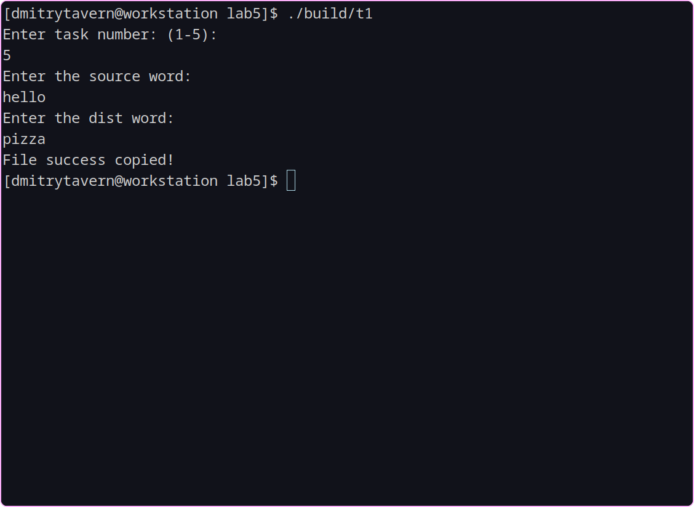

# Lab 5

Task 1: Write a program that uses QTextStream to read data from a text file. The program must read each line from the file and display it on the console screen.

Task 2: Write a program that uses QTextStream to write data to a text file. The program should prompt the user for a string of of text, and write this string to a file.

Task 3: Write a program that uses QTextStream to read data from the console and display it on the screen. The program should wait for user input and display the entered string on the screen.

Task 4: Write a program that uses QTextStream to read numbers from a text file and find their arithmetic mean. The program should read each number from the file and add it to a variable that stores the total sum of the numbers. After that, the program should calculate the arithmetic mean using the formula sum / n, where sum is the total sum of numbers and n is the number of numbers.

Task 5: Write a program that uses QTextStream to read data from a text file and write data to another text file. The program should read each line from the file and write it to the new file, replacing all occurrences of a certain word with another word. Words to replace the program should ask the user.

## Screenshots

