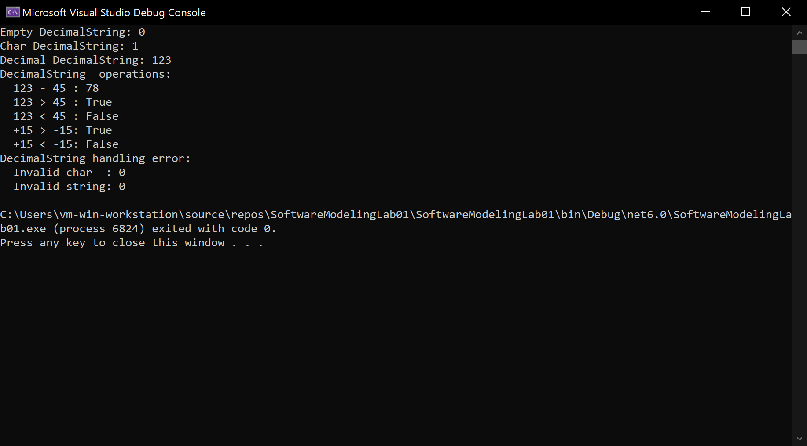

# Lab 1

Describe the basic String class:

- Class fields:

  - a field for storing period characters
  - word type value for storing the string length in bytes

- Class methods:

  - constructor without parameters
  - a constructor that takes a string literal as a parameter
  - a constructor that accepts a symbol as a parameter
  - the method of obtaining the length of the term
  - method of clearing the term (make the term empty)

Describe the DecimalString class derived from String. Strings of this class can contain only symbols of decimal digits and symbols - and +, specifying the sign of the number. The symbols - or + can be found only in the first position of the number, and the symbol + can be absent, in which case the number is considered positive. If any characters other than the allowed characters are found in the initialization string, the class takes a null value. The content of the given string is treated as a decimal number.

Class methods:

- a constructor that accepts a number as a parameter
- arithmetic difference of terms
- check for more (by value)
- check for less (by value)

## Результат

