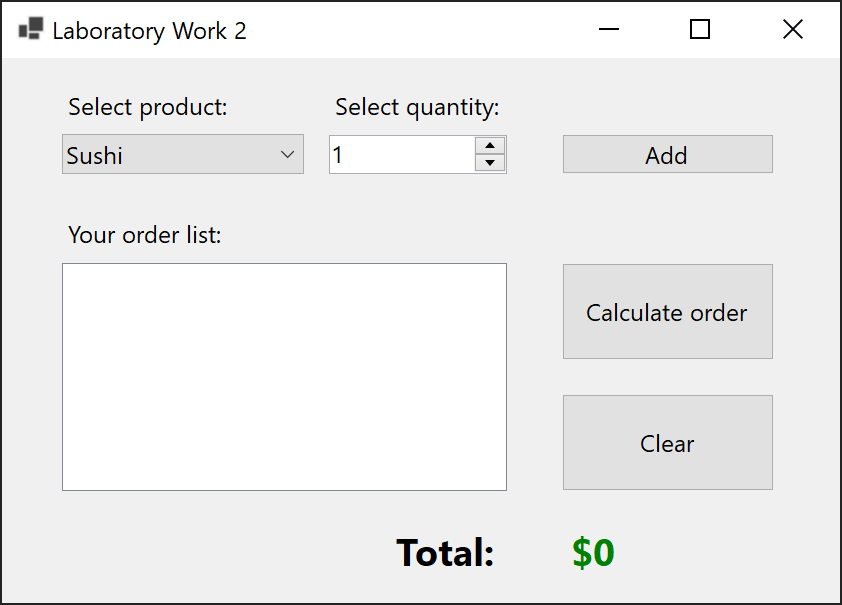
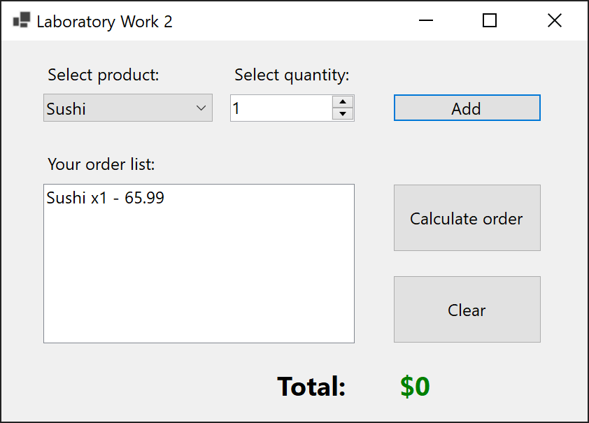
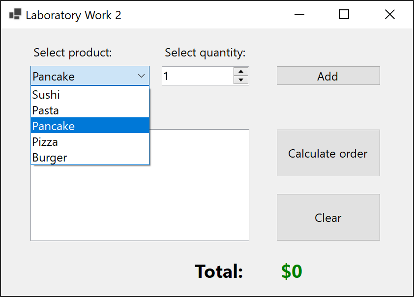
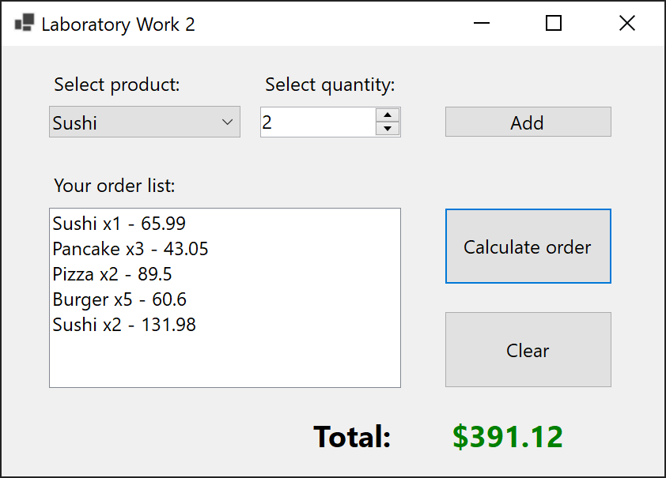
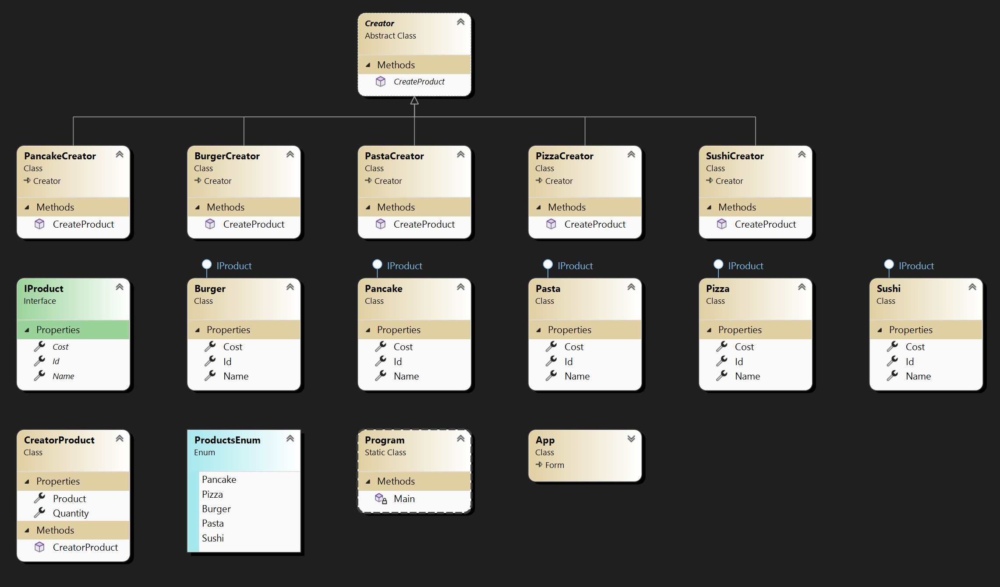

# Lab 2.1

Subject area - Cafe. It is necessary to apply the Factory method pattern in order to calculate the cost of an order in a cafe. Let there be a hierarchy of classes of objects "Food in a cafe", which have the names "Ice cream", "Pancake", "Pastry". The properties of the classes include: the name of the dish, the price, the number of the dish in the menu. The actions of the software application are as follows. The client enters the dish numbers and quantity, and as a result receives information about the order. Creation of the corresponding instance of the class is carried out through the Factory method, the number of the dish and its quantity are passed as parameters.

## Screenshots

## Comment

Not a difficult, but very indicative task for the practice of the Factory Pattern. Changes:

- Other products have been added.
- Products were added to Enum to create some kind of single source of truth (something like constants).
- The product quantity has been moved to a separate class (**CreatorProduct**), which is a wrapper over the product class. This is done for the sake of the principle of shared responsibility and to increase flexibility.
