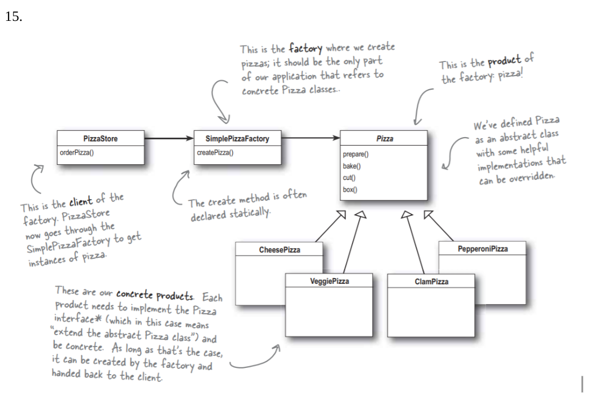
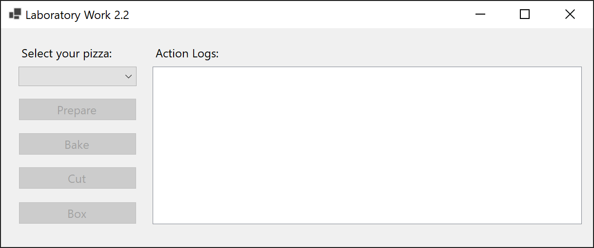
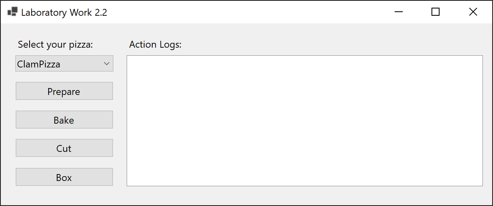
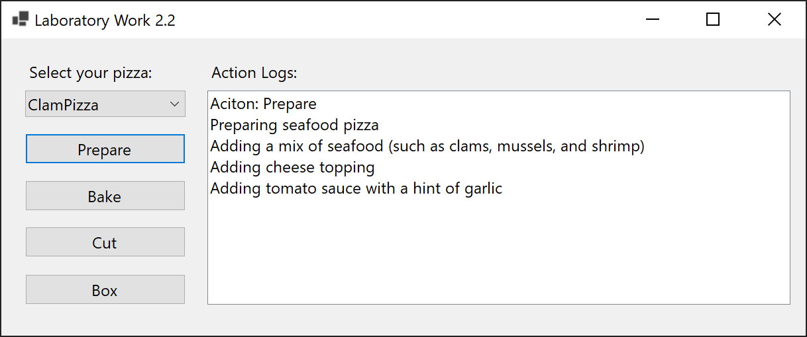
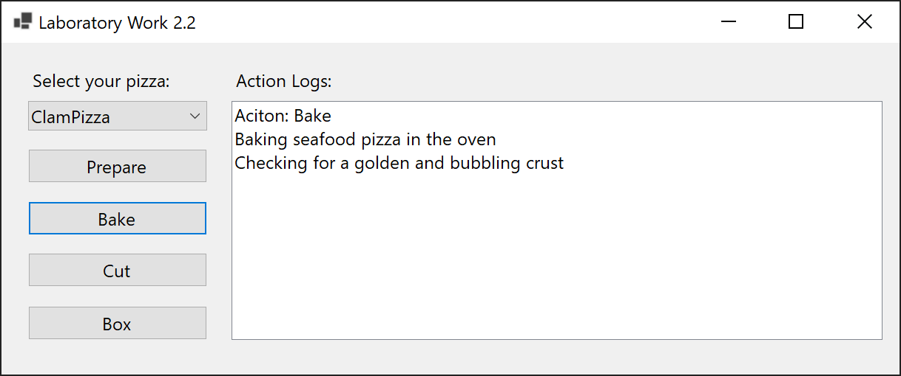
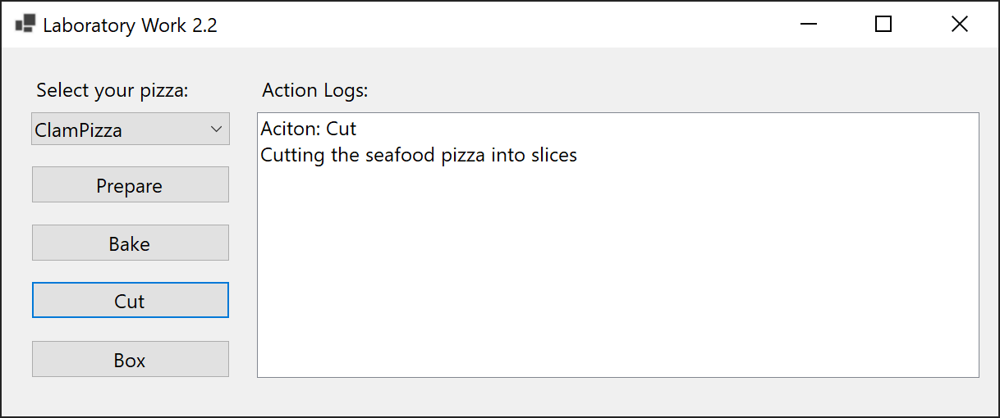
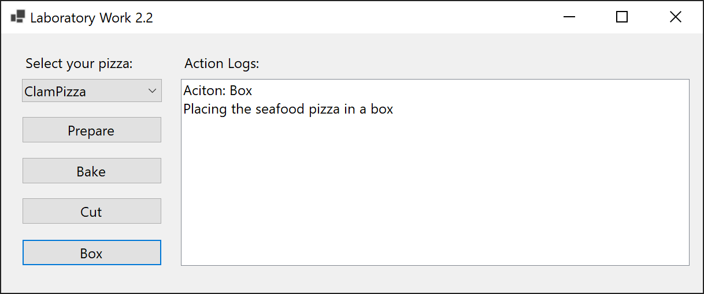
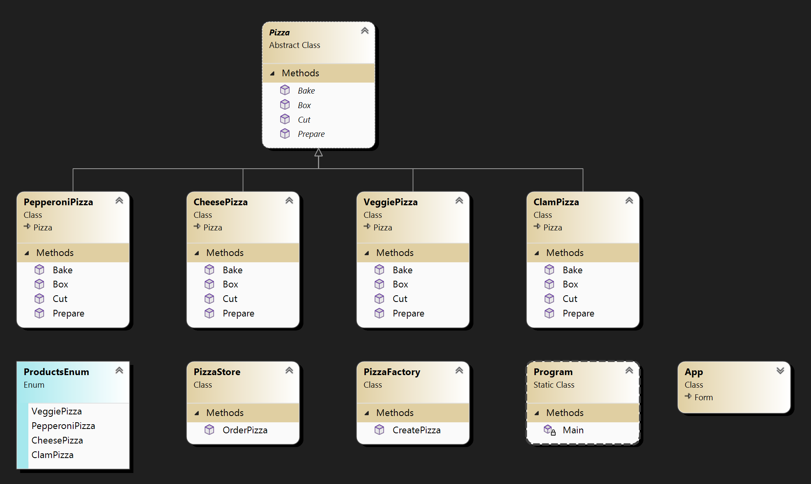

# Lab 2.2

Describe the program using the following diagram:

## Screenshots

## Comment

The task is simpler than the previous one, but unlike the previous task, each product is created not through its own factory, but through one common one.
