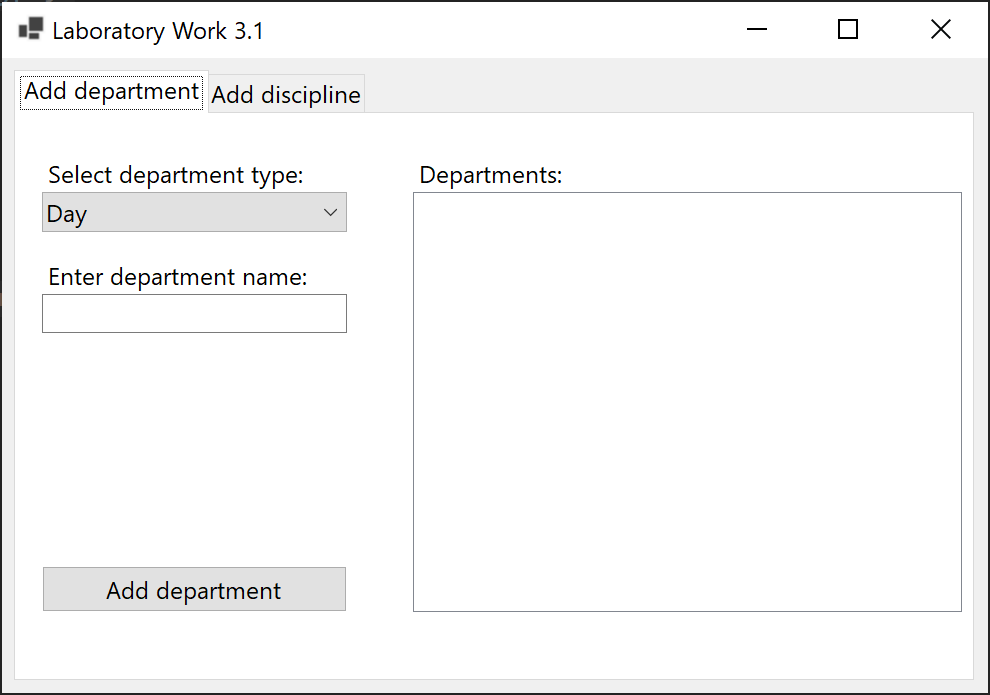
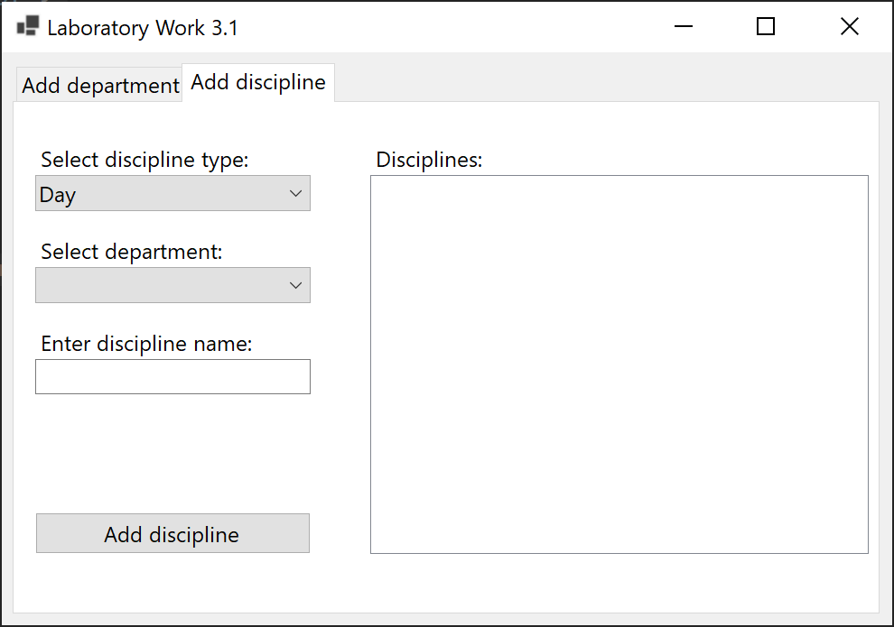
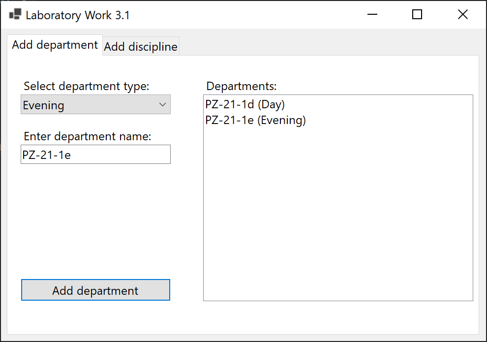
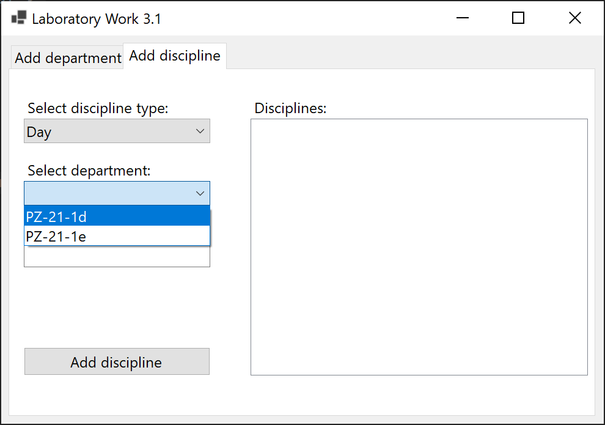
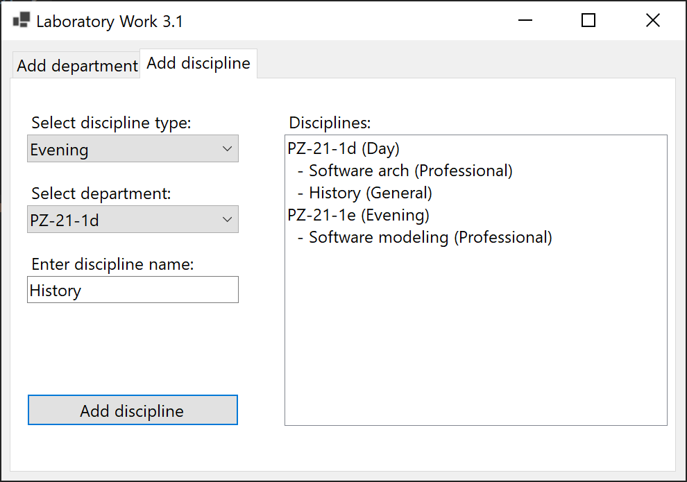
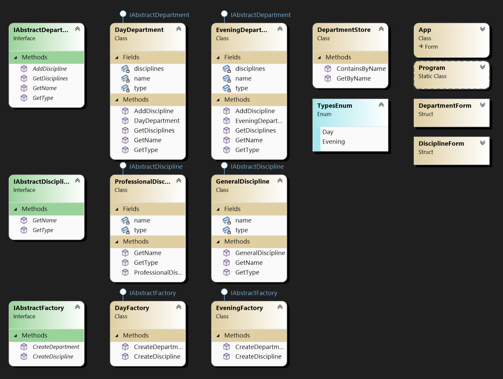

# Lab 3.1

Describe and define the Abstract Factory pattern in the university subject area. Abstract products of the group and discipline. Specific products are typical: full-time department, part-time department, disciplines of professional integrity, disciplines of the outside world level.

## Screenshots

## Comment

It is a problematic task to connect the Abstract Factory pattern and the Windows Form. There are abstract farbics and abstract products.
