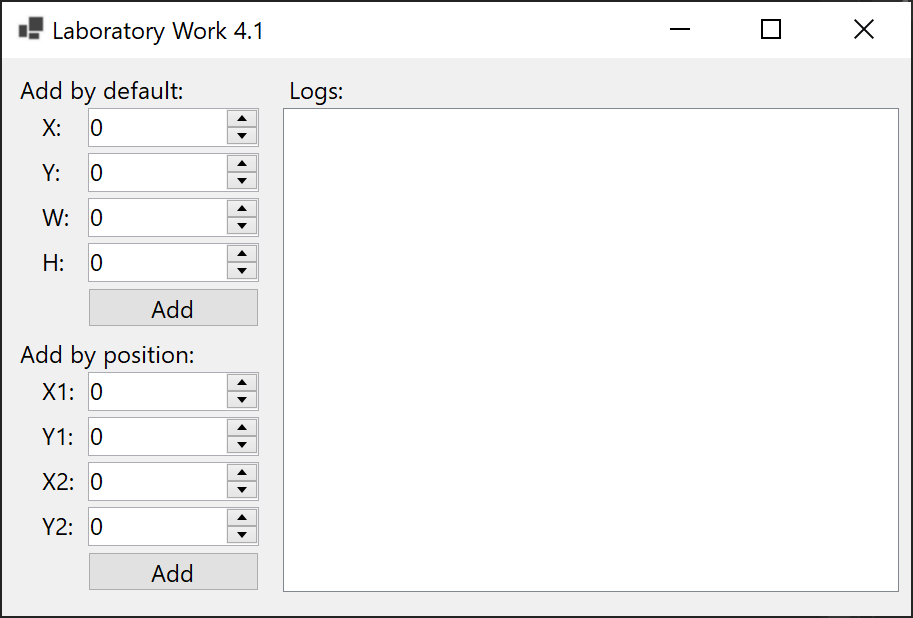
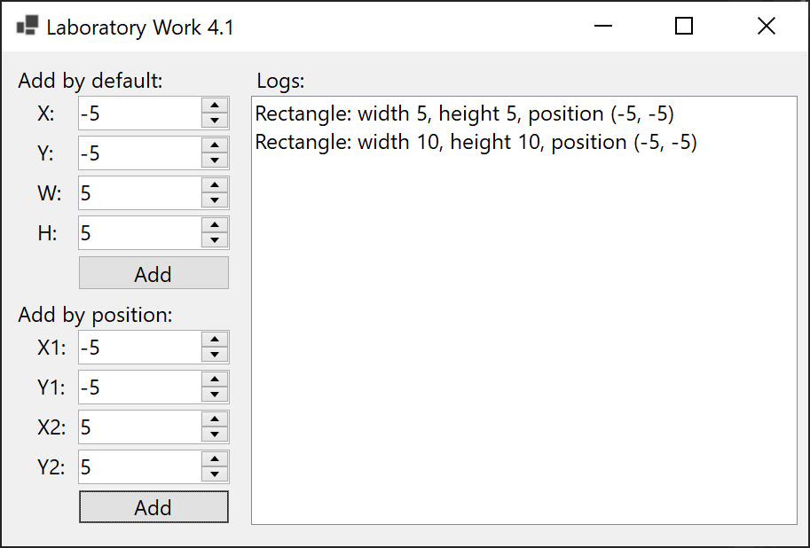
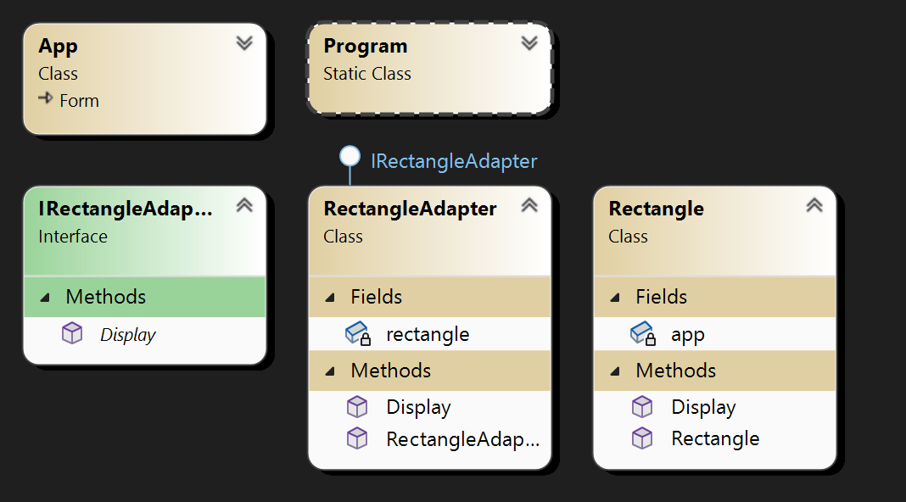

# Lab 4.1

Implement the Adapter pattern for the given class diagram. Let there be a rectangle class with a display method that should receive the dimensions of the sides and location coordinates. But there was a need for the client to pass the coordinates of the upper left corner and the coordinates of the lower right corner to the display method.

## Screenshots

## Comment

Not a difficult demonstration task.
