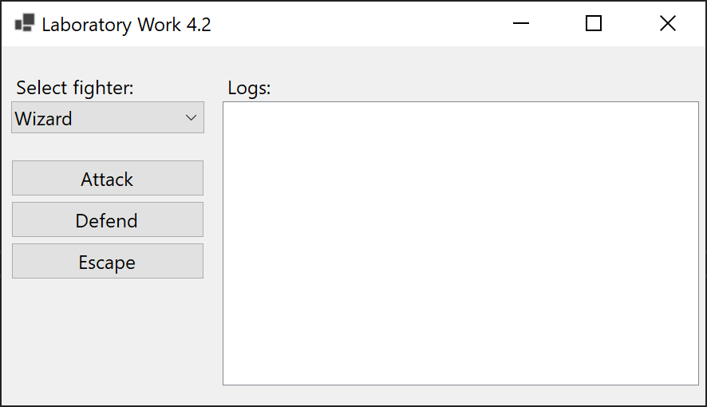
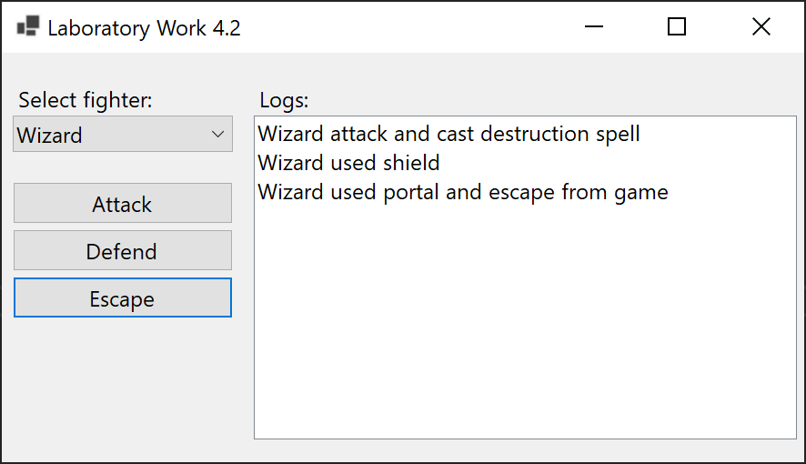
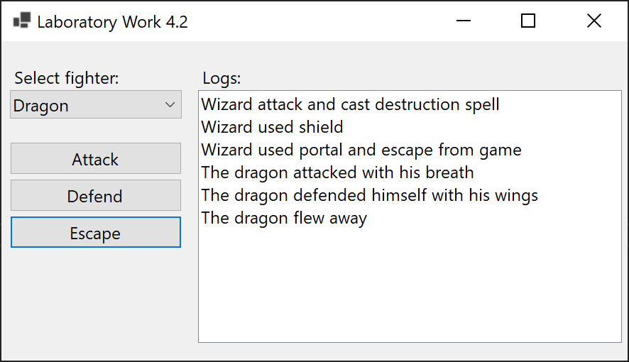
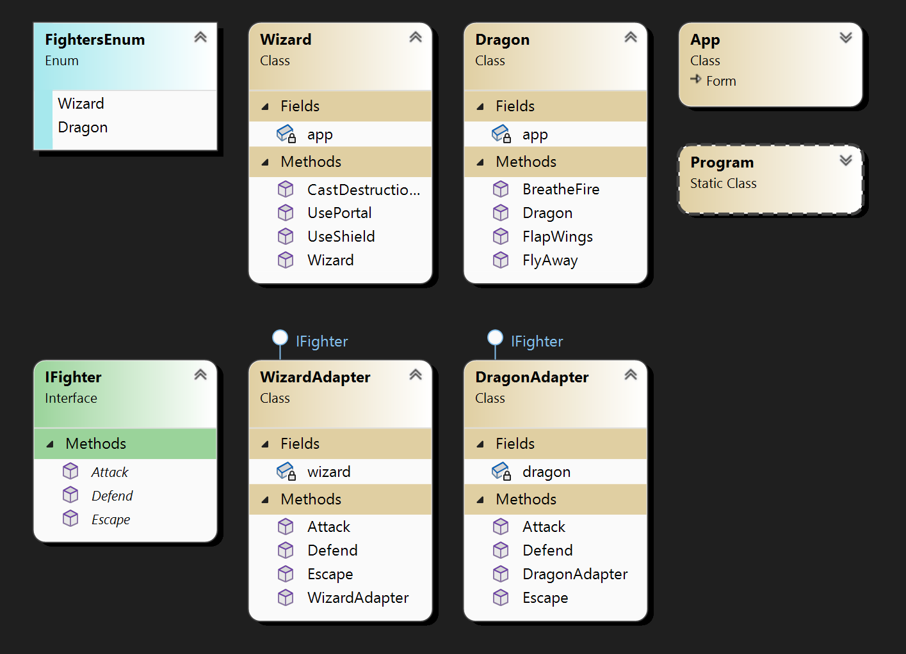

# Lab 4.2

Implement adapter using class diagram. The сlient is a target interface and the **Wizard** is the adaptee. In order to facilitate the use of **Wizard**, we have created **WizardAdapter** which implements target interface **IFighter** but delegates work to adaptee.

## Screenshots

## Comment

A very illustrative task of why adapters are needed. Character classes have their own methods for a number of actions, and in order to standardize them, each class had its own adapter. Changes:

- Added a new **Dragon** class for more demonstrative operation of the adapter pattern.
