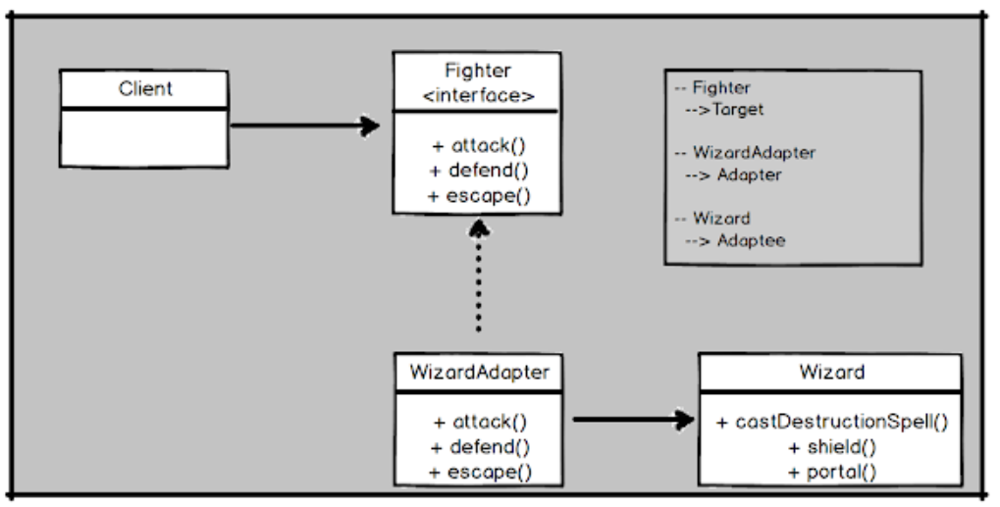

# Lab 4.1

Task: Implement Adapter using class diagram. The Client is a target interface and the Wizard is the Adaptee. In order to facilitate the use of Wizard, we have created WizardAdapter which implements target interface Fighter but delegates work to Adaptee.

## Результат
