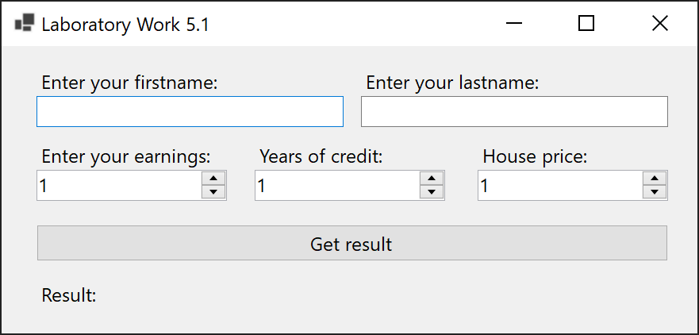
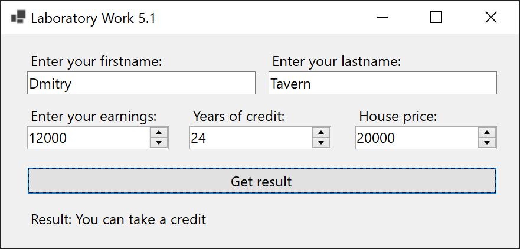
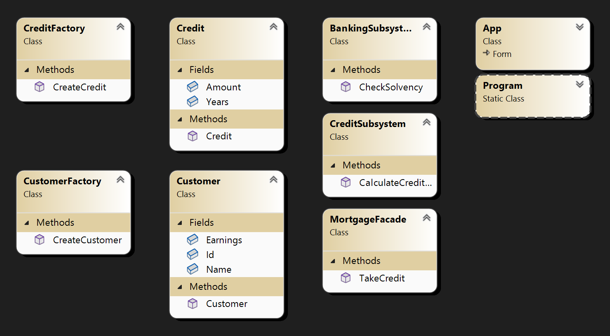

# Lab 5.1

Task: Implement a pattern Facade for a subject area system that describes the work of the bank's lending departments. Let the subject area has a Bank Customer who wants to take a mortgage loan for a house. The customer is described by the properties Last Name, Occupation. The bank has a loan department that provides mortgage loans. The customer interacts with a representative of the loan department.

## Screenshots

## Comment

The problem demonstrates the façade pattern. In a real project, the logic of the facade can be much more complex and complex.
