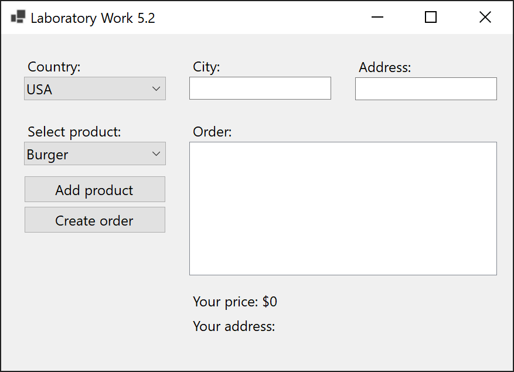
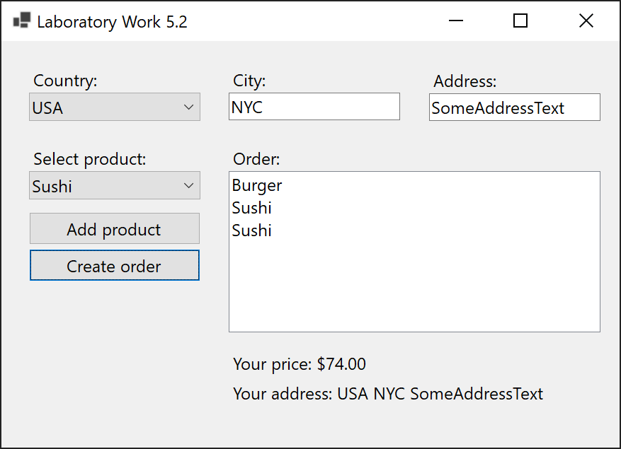
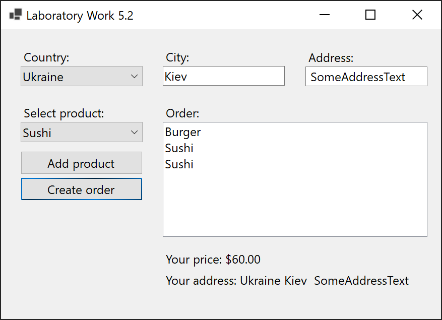
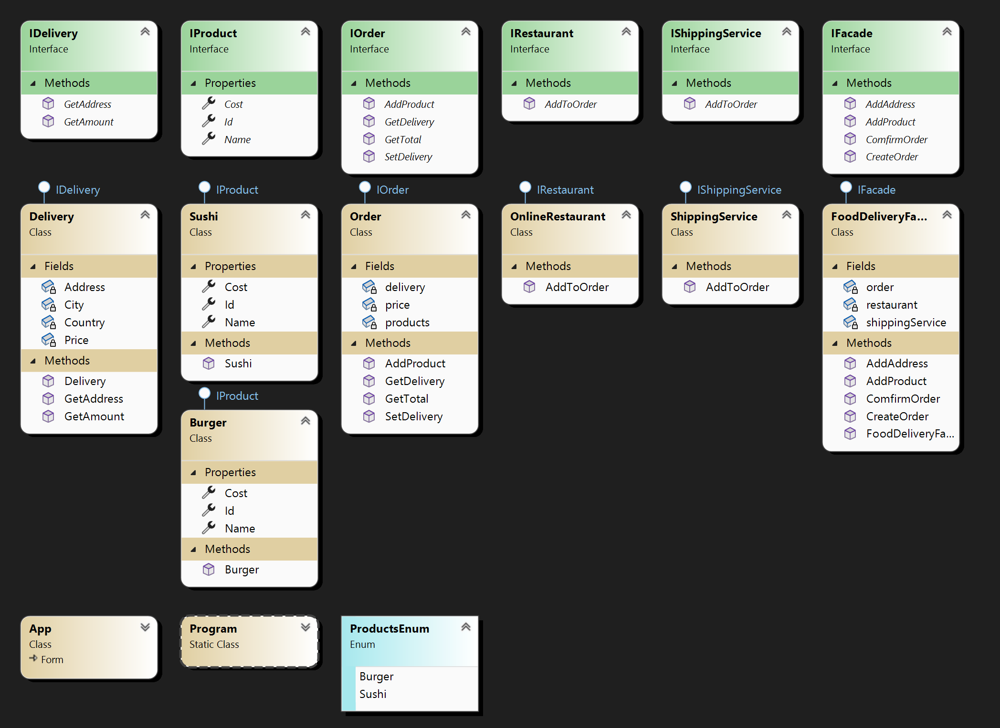

# Lab 5.2

You need to create a software facade (Facade) to better understand this design pattern, which will model the process of ordering food online. Let's say you have a list of restaurants. The user can open restaurant pages, choose dishes they like, and add them to the cart. This can be done as many times as needed, and when the user completes their order, they receive an order confirmation along with the total cost.

## Screenshots

## Comment

Unlike the previous task, this one better demonstrates the need to use the façade pattern. In addition, the code is designed in such a way that you can add new entities, such as restaurants, delivery methods and services, types of orders, products, and even new facades that may contain slightly different logic.

Also, the logic of the existing façade can be complicated as needed.
