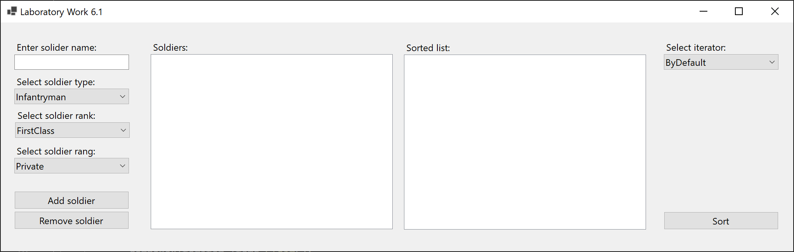
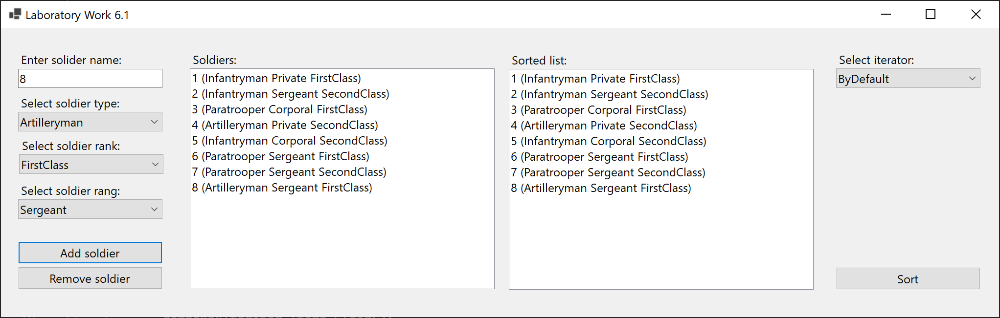
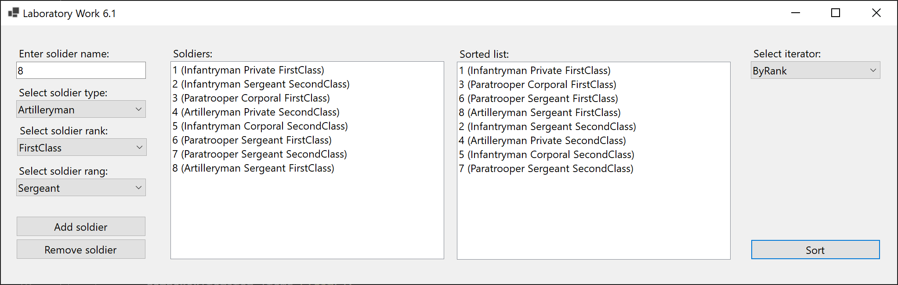
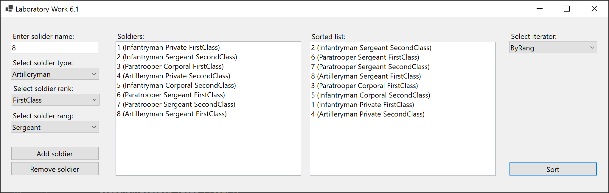
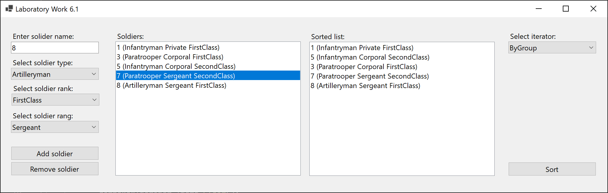
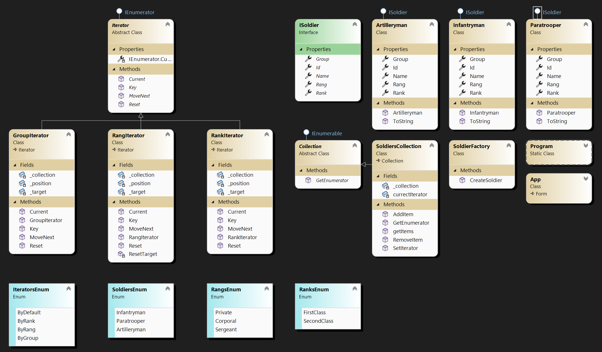

# Lab 6.1

Establish the Iterator pattern within the framework of a strategic game, where 3 groups of soldiers are described: infantry, paratroopers, artillerymen, each of which is described by the name of the group and the size. The skin of the soldier has the power of “Nick”, “Rank”, “Zvannya”. In classes that describe groups of soldiers, methods for adding and identifying a soldier are implemented. Classes-iterators describe the mechanisms of seeing a list of all soldiers of a given group, forming a bypass to show the order of a skin soldier, forming a bypass to show the faces of a skin soldier, seeing a list of soldiers by type up to rank, seeing a list of soldiers by descending order. yskovogo call.

## Screenshots

## Comment

The task is complicated by its algorithms, because you can’t just copy a collection and carry out sorting manipulations using built-in functions.
