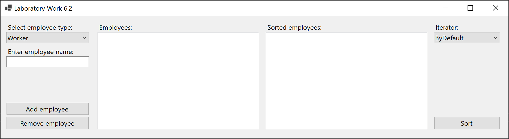
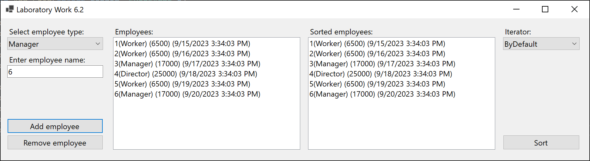
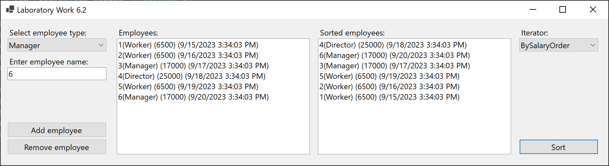
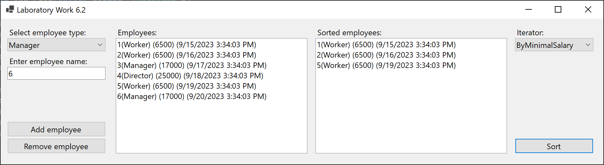
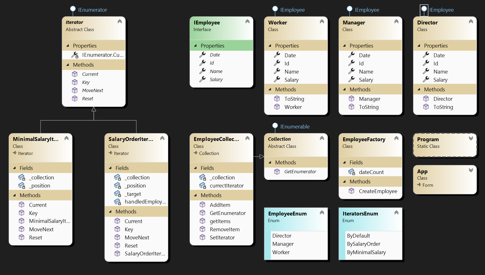

# Lab 6.2

Apply the Iterator pattern within the "Accounting" subject area. The List class stores n elements of the employees class with the properties: "name", "job title", "salary amount", "date of employment". The StaffList class describes the actions of adding a new employee, deleting a given employee, and contains information about the total number of employees. Implement traversals for lists in iterators:

- issue a list of all employees sorted by the amount of salary from the highest to the lowest

- list of all employees who have a minimum wage (=6300)

## Screenshots

## Comment

The task is complicated by its algorithms, because you can’t just copy a collection and carry out sorting manipulations using built-in functions.
