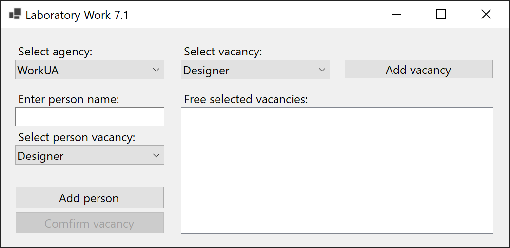
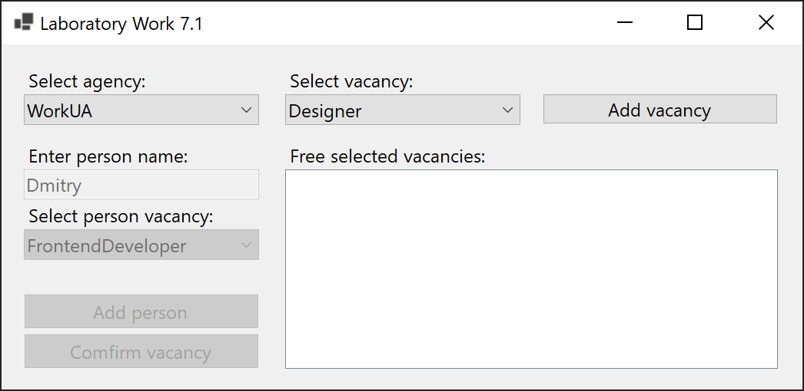
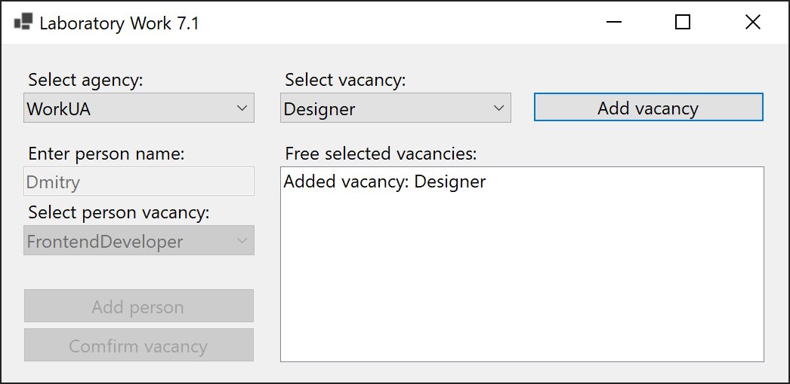
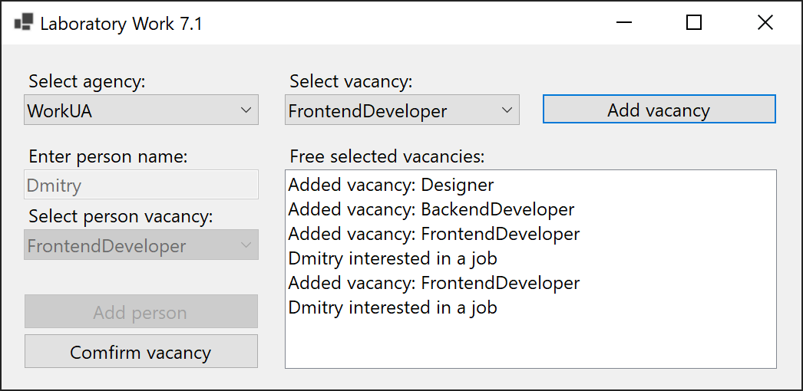
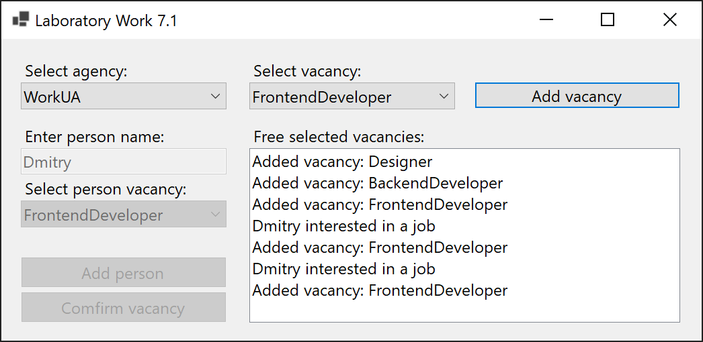
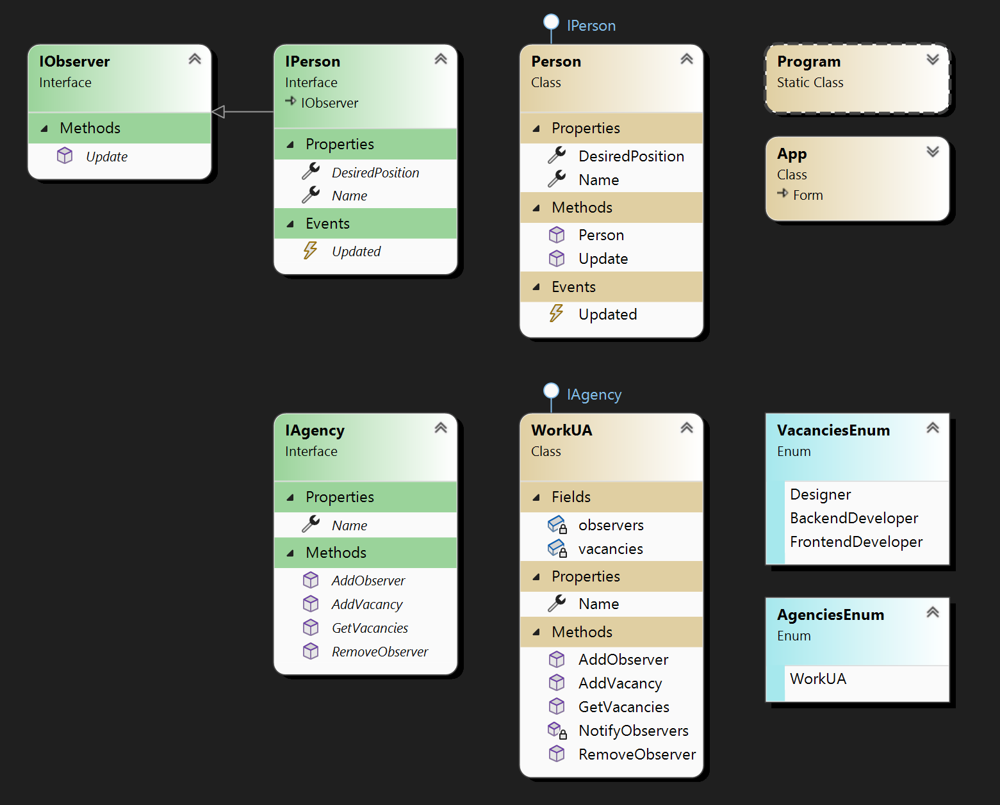

# Lab 7.1

Apply the Observer pattern to the recruitment agency subject area. A person looking for a job signs up for an ad in a recruitment agency. In the class of a person, the position that a person is looking for is set. When a necessary position in the agency appears, a person receives a notification about the vacancy. A person can volunteer for a job and then he is removed from the notification list.

## Screenshots

## Comment