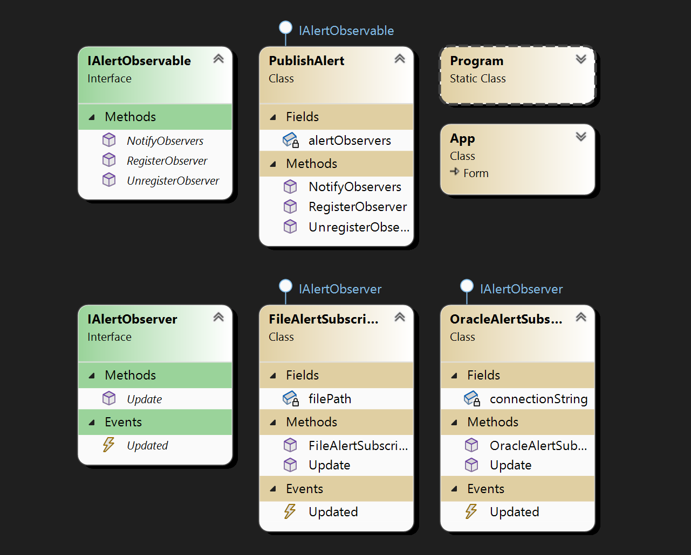

# Lab 7.2

Creation of a system for monitoring events (alerts). Components:

- **AlertObservable**: This object can be observed. Its condition may change over time.
- **AlertObserver** (Observer): Observers of this object wait for a notification about a change in the state of the observed object.
- **PublishAlert** (Publisher of Alerts): This object is responsible for publishing alerts when the state of an AlertObservable changes. It should inform all registered AlertObservers about these changes.

## Screenshots

## Comment

Not a difficult task.
