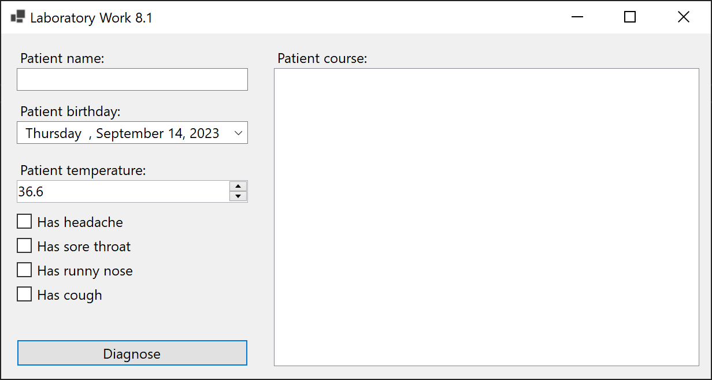
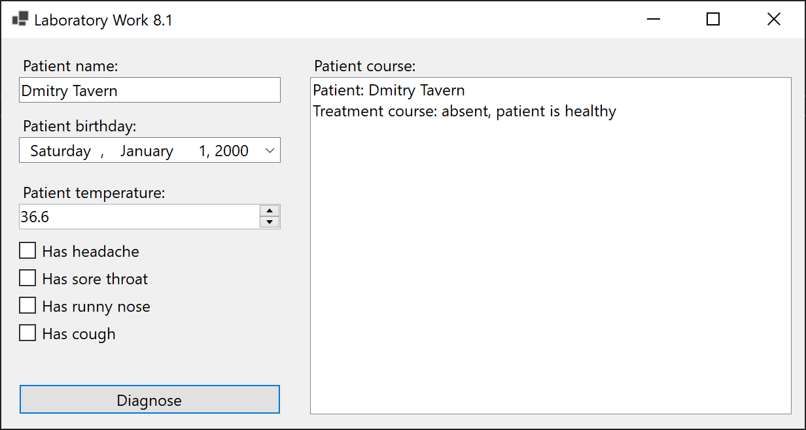
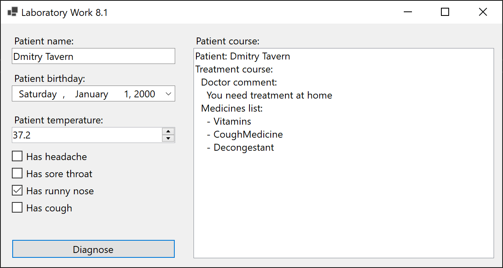
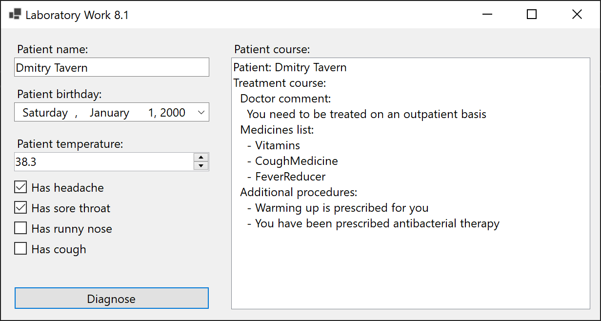
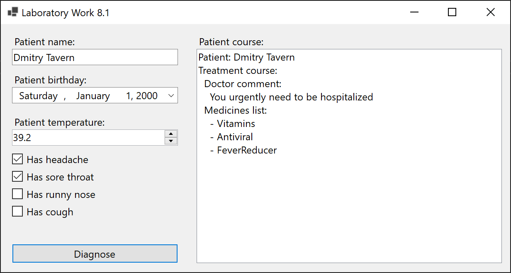
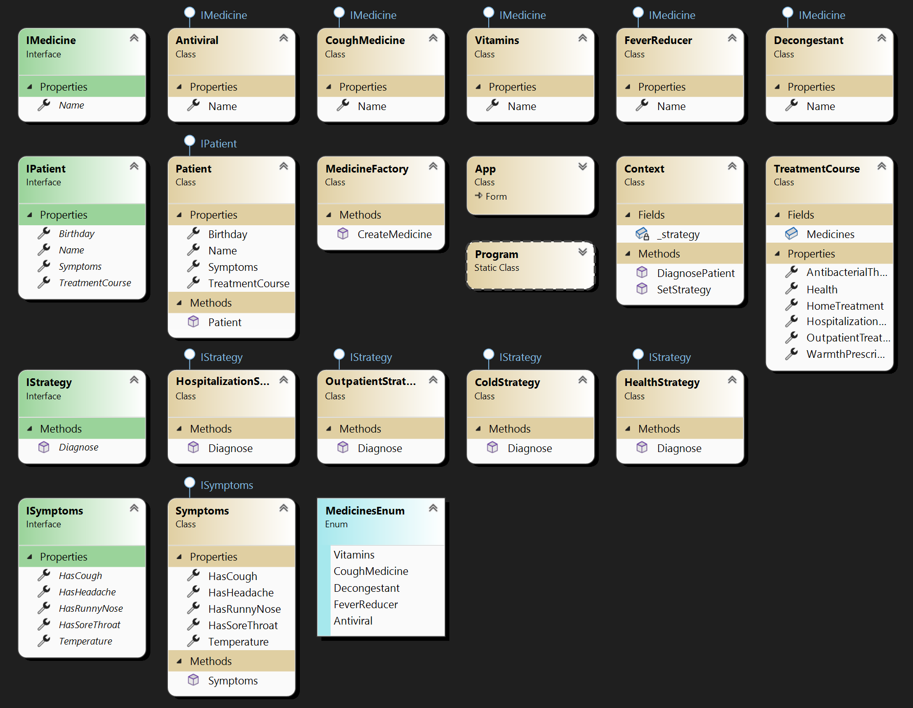

# Lab 8.1

In the doctor's decision support system, patient data is considered, including their full name, date of birth, and a list of symptoms. The list of symptoms includes the patient's temperature and logical indications, such as a headache, malaise, sore throat, and the presence of a cough. After examining the patient, the doctor must make decisions regarding their further treatment, determine the treatment location, and prescribe a list of medications.

Using the Strategy pattern, the following decision rules are defined:

- If the temperature is below 38 degrees Celsius and there is no headache or sore throat, the patient is treated at home. In this case, vitamins, remedies for malaise, and cough medicines are prescribed.

- If the temperature is between 38 and 39 degrees Celsius, and there is a cough, the patient is treated on an outpatient basis. Treatment includes warming, prescription of antipyretic drugs, vitamins, antibacterial therapy, and cough remedies.

- If the temperature is above 39 degrees Celsius, and the patient has a headache, they need to be hospitalized. Treatment involves prescribing antiviral drugs, antipyretics, and vitamins.

- To implement this system, utilize the Strategy pattern, where each strategy corresponds to a specific patient treatment scenario. The doctor selects the appropriate strategy based on the patient's symptoms and temperature.

## Screenshots

## Comment
