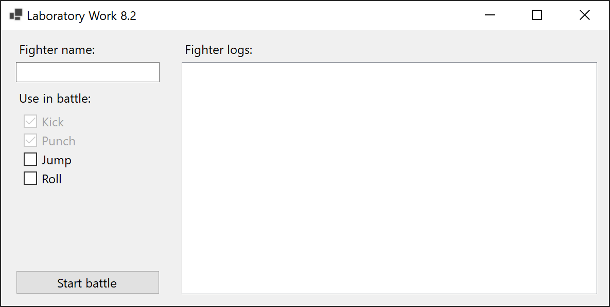
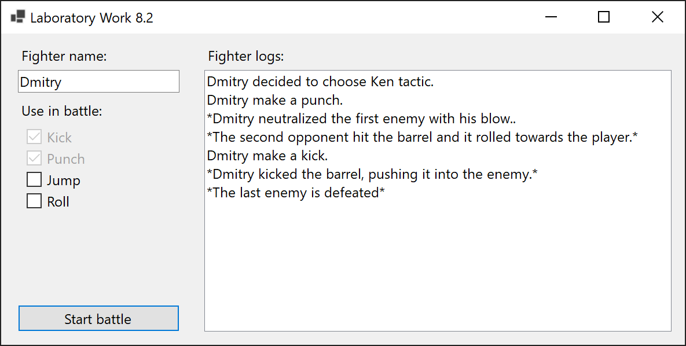
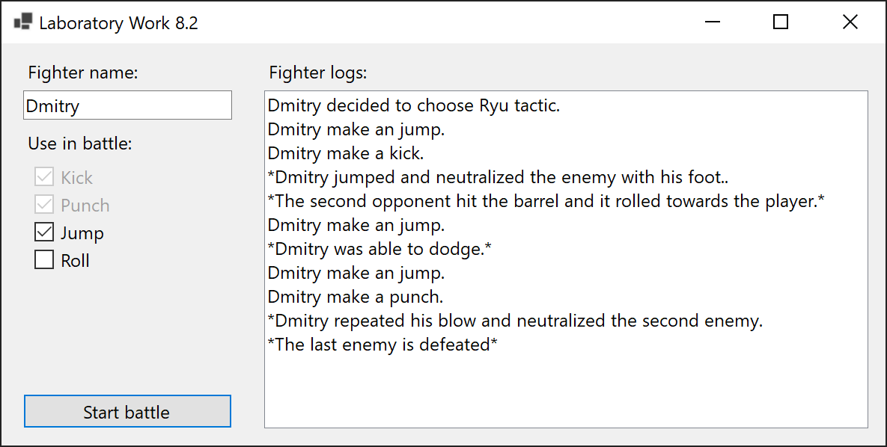
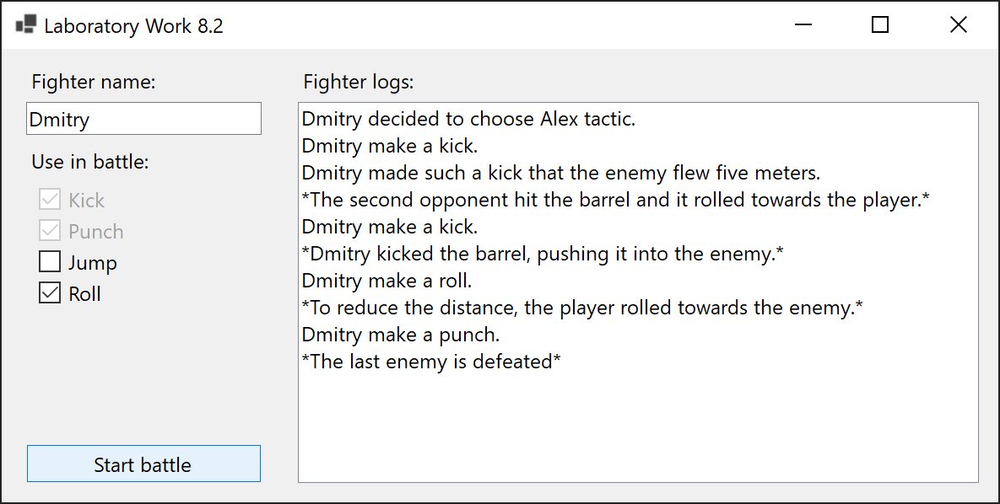
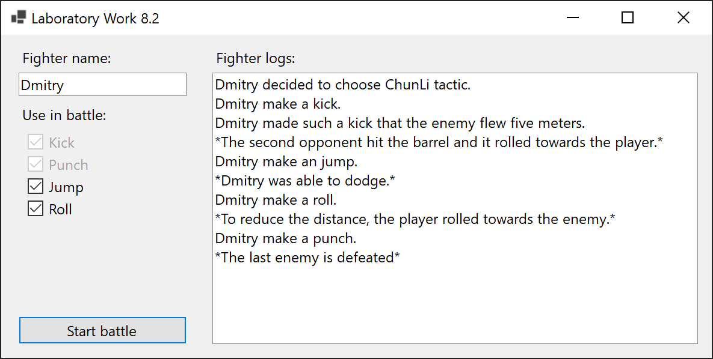
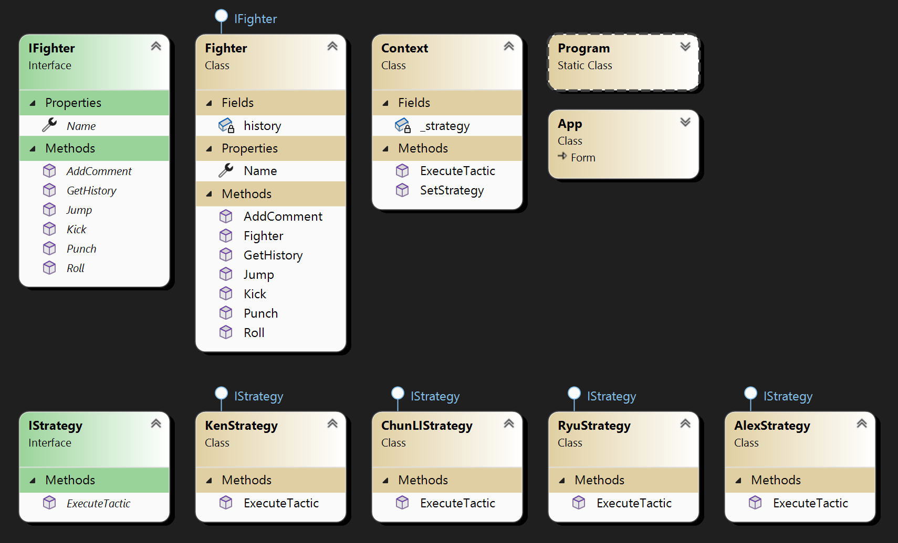

# Lab 8.2

Let's say we're making a Street Fighter game. For simplicity, let's assume that a character can have four moves: kick, arm, roll, and jump. Each character has leg and arm movements, but flips and jumps are optional.

## Screenshots

## Comment

The task is quite strange.
